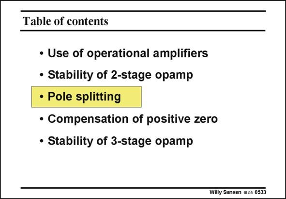

# SANSEN-0533 · Table of contents

章节：05 运算放大器的稳定性  
PDF 页：162；书本页：166；幻灯片编号：0533  
状态：unreviewed



## 对应教材讲解

### PDF 161 · 书本 165

The stability requirement forces us to position the non-dominant pole at sufficiently high frequencies (around 3 GBW).

### PDF 162 · 书本 166

The question now is, how to carry out the design? Which parameters are we going to use in the design plan to shift the non-dominant pole. We will find that there are two possible design plans, both with advantages and disadvantages. Both of them lead to pole splitting, which allows us to move this nondominant pole to even higher values.

## 公式／性能结论候选摘录

以下为规则截取的原文，尚未逐项判读。

（未由规则找到；不代表原页没有此类内容。）

## 曲线结论候选摘录

以下为规则截取的原文，尚未逐项判读。

（未由规则找到；不代表原页没有此类内容。）

## 原文条件与近似候选摘录

以下为规则截取的原文，尚未逐项判读。

（未由规则找到；不代表原页没有此类内容。）

## 幻灯片 OCR（未校正）

```text
Table of contents
• Use of operational amplifiers
• Stability of 2-stage opamp
• Pole splitting
• Compensation of positive zero
• Stability of 3-stage opamp
Willy Sansen 10 a5 0533
```

数学上下标、分数及正负号以原图为准。电路图已保留；未核对的连接不输出成可仿真 netlist。
