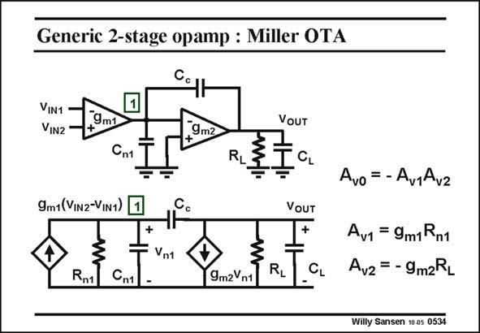

# SANSEN-0534 · Generic 2-stage opamp : Miller OTA

章节：05 运算放大器的稳定性  
PDF 页：162；书本页：166；幻灯片编号：0534  
状态：unreviewed



## 对应教材讲解

### PDF 162 · 书本 166

Let us now take the twostage operational amplifier. We substitute the g -blocks m by their voltage controlled current sources. Also, node resistances are added on each node, representing the output impedances. Therefore, the small-signal equivalent circuit is obtained. The low-frequency gains A and A are easily v1 v2 derived as they are merely products of g ’s and output m resistances. The total gain A is then their product. v Addition of all capacitances provides an expression of the gain versus frequency, which is of second order. It is only of second order, despite the fact that we distinguish three capacitances, because the three capacitances form a capacitive loop. Disrupting this loop, for example by putting in a series resistor somewhere in this loop, would raise the order of the gain expression to three. The analysis would then become much more cumbersome.

## 公式／性能结论候选摘录

以下为规则截取的原文，尚未逐项判读。

- PDF 162: Therefore, the small-signal equivalent circuit is obtained.
- PDF 162: The total gain A is then their product. v Addition of all capacitances provides an expression of the gain versus frequency, which is of second order.
- PDF 162: Disrupting this loop, for example by putting in a series resistor somewhere in this loop, would raise the order of the gain expression to three.

## 曲线结论候选摘录

以下为规则截取的原文，尚未逐项判读。

（未由规则找到；不代表原页没有此类内容。）

## 原文条件与近似候选摘录

以下为规则截取的原文，尚未逐项判读。

（未由规则找到；不代表原页没有此类内容。）

## 幻灯片 OCR（未校正）

```text
Generic 2-stage opamp : Miller OTA
VIN1
VIN2
9m1
9m2
+
Cnt
RL
9m1 (ViN2-VIN1)
1
Cc
+
VOUT
CL
VOUT
+
Vnt
Rn1|
Cn1
9m2Vn1
CL
Avo=-AurAvz
Av1 = 9m1Rn1
Avz = - 9m2RL
Willy Sansen 10.05 0534
```

数学上下标、分数及正负号以原图为准。电路图已保留；未核对的连接不输出成可仿真 netlist。
