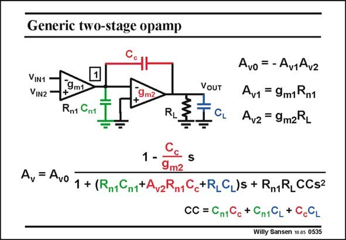

# SANSEN-0535 · Generic two-stage opamp

章节：05 运算放大器的稳定性  
PDF 页：163；书本页：167；幻灯片编号：0535  
状态：unreviewed



## 对应教材讲解

### PDF 162 · 书本 166

The full expression of the gain A is given in this slide. Only two approximations have been v taken. We have assumed that the gain is larger than unity and that node resistance resistor R n1 is larger than load resistance R . L

### PDF 163 · 书本 167

The denominator is of second order in s or jv. It now has two roots, which are the two poles. They can be real or complex. The numerator has one root only, which is the zero. It is a positive zero (in the polar diagram). The question is again how we have to dimension C c and/or g to shift the nonm2 dominant pole out to higher frequencies? For this purpose, we have to take a look at the positions of the poles when C c is varied. This is not so obvious as C occurs at several places in the denominator. In order to figure out c how the two poles (and the zero) change as we vary C , we draw the pole-zero position diagram. c

## 公式／性能结论候选摘录

以下为规则截取的原文，尚未逐项判读。

- PDF 162: The full expression of the gain A is given in this slide.
- PDF 162: We have assumed that the gain is larger than unity and that node resistance resistor R n1 is larger than load resistance R .

## 曲线结论候选摘录

以下为规则截取的原文，尚未逐项判读。

（未由规则找到；不代表原页没有此类内容。）

## 原文条件与近似候选摘录

以下为规则截取的原文，尚未逐项判读。

- PDF 162: Only two approximations have been v taken.
- PDF 162: We have assumed that the gain is larger than unity and that node resistance resistor R n1 is larger than load resistance R .

## 幻灯片 OCR（未校正）

```text
Generic two-stage opamp
VIN1
VIN2
9m1
R1 Cnt
9m2
R
VOUT
1
CL
Avo
=-Av1Av2
Av1 = 9m1Rn1
Avz = 9m2RL
Av = Avo
mz
1 + (Rn1Cn1tAv2Rn1C+RLCL)5 + RmRICCs2
CC = Cn1C
c + Cn19L + C.9L
Willy Sansen 10.05 0535
```

数学上下标、分数及正负号以原图为准。电路图已保留；未核对的连接不输出成可仿真 netlist。
