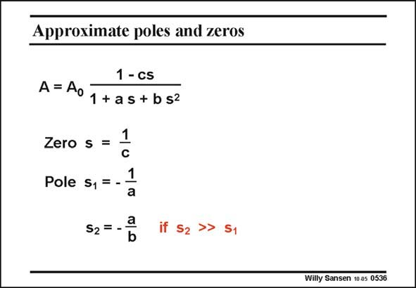

# SANSEN-0536 · Approximate poles and zeros

章节：05 运算放大器的稳定性  
PDF 页：163；书本页：167；幻灯片编号：0536  
状态：unreviewed



## 对应教材讲解

### PDF 163 · 书本 167

It is not so difficult to obtain the two poles. After all, they are the roots of the denominator, which is just a second-order expression. In most cases however, there is an easy way to obtain the poles. We assume that the poles have values which are widely different. Indeed, we expect to find a dominant pole and a nondominant pole which are very different. In this case, the dominant pole can be obtained by dropping the term in s2 in the denominator. The dominant pole is simply −1/a. The non-dominant pole is also easy to find. It is obtained by dropping the term 1 in the denominator, and by taking out one s. The non-dominant pole is simply −a/b. Clearly, as coefficient a changes as a result of a parameter change somewhere, both poles are then affected, but in opposite ways. If the dominant pole decreases, the non-dominant pole must increase. This will be the basis for pole splitting.

## 公式／性能结论候选摘录

以下为规则截取的原文，尚未逐项判读。

- PDF 163: Clearly, as coefficient a changes as a result of a parameter change somewhere, both poles are then affected, but in opposite ways.
- PDF 163: If the dominant pole decreases, the non-dominant pole must increase.

## 曲线结论候选摘录

以下为规则截取的原文，尚未逐项判读。

（未由规则找到；不代表原页没有此类内容。）

## 原文条件与近似候选摘录

以下为规则截取的原文，尚未逐项判读。

- PDF 163: We assume that the poles have values which are widely different.

## 幻灯片 OCR（未校正）

```text
Approximate poles and zeros
1 - cs
A=Aoy+as+b52
Zero s = 1
Pole s, = - 1
S2=_a
b
Willy Sansen 1005 0536
```

数学上下标、分数及正负号以原图为准。电路图已保留；未核对的连接不输出成可仿真 netlist。
