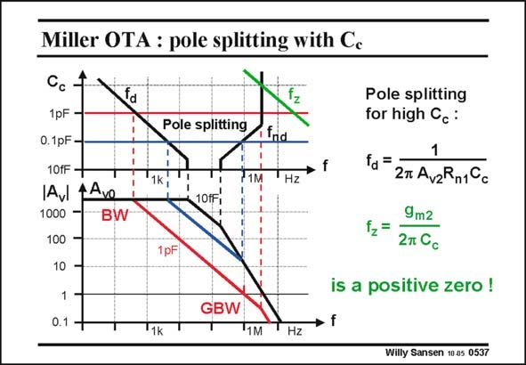

# SANSEN-0537 · Miller OTA : pole splitting with Cc

章节：05 运算放大器的稳定性  
PDF 页：164；书本页：168；幻灯片编号：0537  
状态：unreviewed



## 对应教材讲解

### PDF 164 · 书本 168

The pole-zero position diagram is a plot of the poles and zero versus frequency, for one of the design parameters as a variable. The frequency axis is the same as in the Bode diagram. In this example, compensation capacitance C is c taken as a design variable. Indeed, we want to see how C can be used to shift out c the second pole to higher frequencies than GBW. Clearly for a C smaller c than 10 fF, two poles occur. They are fairly close to each other. The Bode diagram is now easily sketched. However, for larger C (larger than about 20 fF in this example) the poles split. The dominant c pole f becomes ever more dominant. d The non-dominant pole f now shifts out, as intended. nd The Bode diagrams are added for values of C of 0.1 and 1 pF. It is clear that for a C of c c 1 pF, sufficient pole splitting has been achieved. Indeed, the f is about three times larger than nd the GBW, which is about 1 MHz. The expression of the dominant pole is easily extracted from the expression of the gain. This is given in this slide. It is clearly due to the Miller effect of this (fairly large) capacitor C . c However, we also have a positive zero!

## 公式／性能结论候选摘录

以下为规则截取的原文，尚未逐项判读。

- PDF 164: The expression of the dominant pole is easily extracted from the expression of the gain.

## 曲线结论候选摘录

以下为规则截取的原文，尚未逐项判读。

- PDF 164: The pole-zero position diagram is a plot of the poles and zero versus frequency, for one of the design parameters as a variable.
- PDF 164: The frequency axis is the same as in the Bode diagram.
- PDF 164: The Bode diagram is now easily sketched.
- PDF 164: The dominant c pole f becomes ever more dominant. d The non-dominant pole f now shifts out, as intended. nd The Bode diagrams are added for values of C of 0.1 and 1 pF.

## 原文条件与近似候选摘录

以下为规则截取的原文，尚未逐项判读。

（未由规则找到；不代表原页没有此类内容。）

## 幻灯片 OCR（未校正）

```text
Miller OTA : pole splitting with Cc
1pF
0.1pF
10fF-
IAVl
4Avo
1000
BW
100
10
1
0.1 -
Pole splitting
1k
71M
"Hz
10fF,
1pF
Pole splitting
for high C.:
fd =
27 AvzRn1Cc
9m2
2m Cс
is a positive zero !
GBW
» f
"1k
"1M
Hz
Willy Sansen 10 as 0537
```

数学上下标、分数及正负号以原图为准。电路图已保留；未核对的连接不输出成可仿真 netlist。
