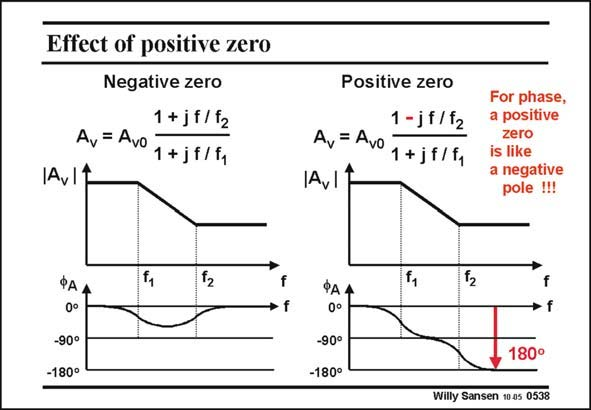

# SANSEN-0538 · Effect of positive zero Negative zero Positive zero

章节：05 运算放大器的稳定性  
PDF 页：164；书本页：168；幻灯片编号：0538  
状态：unreviewed



## 对应教材讲解

### PDF 164 · 书本 168

In order to better understand what a positive zero means, we have to compare the effect on the phase of a positive zero, with that of a negative zero. There is no need to have a second-order system for this purpose. A first-order system can be taken as well. The Bode diagrams are sketched for a first-order system with one single pole and one single zero. In the second case the zero is positive.

### PDF 165 · 书本 169

Both have obviously the same amplitude. Consequently, amplitudes are not affected by signs. They have a very different phase characteristic, however. In the first Bode diagram the phase returns to zero for high frequencies. For the second diagram however, for a positive zero, the phase goes to −180°. This is like having a second pole, rather than a zero! This completely ruins our phase margin!!! We have tried to limit the phase contribution of the non-dominant pole to about 20° by carefully locating this non-dominant pole beyond the GBW. A positive zero now shows up, which brings in another −90°. This will ruin the phase margin. Moreover, the larger we make the compensation capacitance C , the more this zero shifts to c lower frequencies. Large values of C are therefore not allowed! c

## 公式／性能结论候选摘录

以下为规则截取的原文，尚未逐项判读。

- PDF 165: We have tried to limit the phase contribution of the non-dominant pole to about 20° by carefully locating this non-dominant pole beyond the GBW.
- PDF 165: Large values of C are therefore not allowed! c

## 曲线结论候选摘录

以下为规则截取的原文，尚未逐项判读。

- PDF 164: In order to better understand what a positive zero means, we have to compare the effect on the phase of a positive zero, with that of a negative zero.
- PDF 164: The Bode diagrams are sketched for a first-order system with one single pole and one single zero.
- PDF 165: They have a very different phase characteristic, however.
- PDF 165: In the first Bode diagram the phase returns to zero for high frequencies.
- PDF 165: For the second diagram however, for a positive zero, the phase goes to −180°.
- PDF 165: This completely ruins our phase margin!!!
- PDF 165: We have tried to limit the phase contribution of the non-dominant pole to about 20° by carefully locating this non-dominant pole beyond the GBW.
- PDF 165: This will ruin the phase margin.

## 原文条件与近似候选摘录

以下为规则截取的原文，尚未逐项判读。

（未由规则找到；不代表原页没有此类内容。）

## 幻灯片 OCR（未校正）

```text
Effect of positive zero
Negative zero
1 + jf/f2
Av = Avo
1+jf/f,
|Av11
ФА
0°
-90°
-180°
f
→f
Positive zero
1-jf/f2
Av = Avo
1+jf/f,
IA,11
For phase,
a positive
zero
is like
a negative
pole !!!
PAA
0°
-90°
-180°
f
• f.
180°
Willy Sansen 10.05 0538
```

数学上下标、分数及正负号以原图为准。电路图已保留；未核对的连接不输出成可仿真 netlist。
