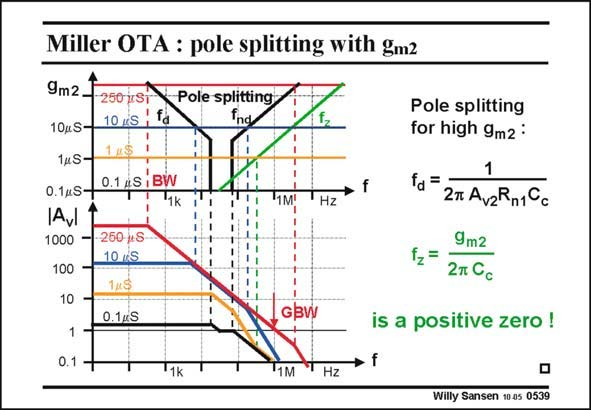

# SANSEN-0539 · Miller OTA : pole splitting with gm2

章节：05 运算放大器的稳定性  
PDF 页：165；书本页：169；幻灯片编号：0539  
状态：unreviewed



## 对应教材讲解

### PDF 165 · 书本 169

Another way to realize the same pole splitting is to use g , set by the current in the m2 second stage. It works even better than with C ! c Increasing the current from low values to higher one causes the dominant pole to be exactly the same as before. In the Miller effect, the g is as much m2 present as C itself. c However, the non-dominant has a better behavior. It keeps on increasing to high values, for high values of g . m2 The main advantage is that the positive zero moves out to higher values, when g increases. m2 Therefore, this zero disappears! As a result, it is a lot easier to realize pole splitting by increasing g than it is with C . m2 c The major drawback of compensating an opamp with g is that the current consumption m2 increases drastically. For low-power designs we therefore prefer to compensate an opamp by increasing the compensation capacitance C . We now have to find other ways of dealing with the positive zero! c

## 公式／性能结论候选摘录

以下为规则截取的原文，尚未逐项判读。

- PDF 165: It keeps on increasing to high values, for high values of g . m2 The main advantage is that the positive zero moves out to higher values, when g increases. m2 Therefore, this zero disappears!
- PDF 165: As a result, it is a lot easier to realize pole splitting by increasing g than it is with C . m2 c The major drawback of compensating an opamp with g is that the current consumption m2 increases drastically.
- PDF 165: For low-power designs we therefore prefer to compensate an opamp by increasing the compensation capacitance C .

## 曲线结论候选摘录

以下为规则截取的原文，尚未逐项判读。

（未由规则找到；不代表原页没有此类内容。）

## 原文条件与近似候选摘录

以下为规则截取的原文，尚未逐项判读。

（未由规则找到；不代表原页没有此类内容。）

## 幻灯片 OCR（未校正）

```text
Miller OTA : pole splitting with gm2
9m2
250 jST
10uS-
10 KS
'fa
1KS
14S-
0.14S-
0.1 4S ,BW
1k
JAVI
1000
Pole splitting
100
250 MS
10 /S
14S)
10
1
0.1 -
0.1KS
VA
'1M!
Hz
GBW
Pole splitting
for high 9m2 :
=
27 AvzRn1Cc
9m2
2m Cc
is a positive zero !
'1k
"1M
Hz
Willy Sansen 10.05 0539
```

数学上下标、分数及正负号以原图为准。电路图已保留；未核对的连接不输出成可仿真 netlist。
