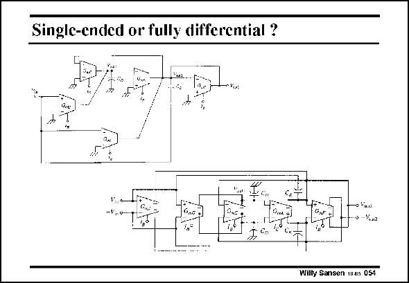

# SANSEN-054 · Single-ended or fully differential ?

章节：05 运算放大器的稳定性  
PDF 页：146；书本页：150；幻灯片编号：054  
状态：unreviewed



## 对应教材讲解

### PDF 146 · 书本 150

Most simple opamps only have one single-output. This has been the case in most discrete electronics. All voltages are referred to ground, which is easy to reach on a printed circuit board, for example. In integrated circuits, more and more analog functions are integrated together with digital blocks. As a result, the substrate is polluted with clock spikes and logic noise. In this mixedsignal environment, all circuits must be fully-differential. This doubles the power consumption but rejects the commonmode noise. We will discuss single-ended amplifiers first and then construct fully-differential amplifiers in Chapter 9.

## 公式／性能结论候选摘录

以下为规则截取的原文，尚未逐项判读。

- PDF 146: As a result, the substrate is polluted with clock spikes and logic noise.

## 曲线结论候选摘录

以下为规则截取的原文，尚未逐项判读。

（未由规则找到；不代表原页没有此类内容。）

## 原文条件与近似候选摘录

以下为规则截取的原文，尚未逐项判读。

（未由规则找到；不代表原页没有此类内容。）

## 幻灯片 OCR（未校正）

```text
Single-ended or fully differential ?
Willy Sansen 1as 054
```

数学上下标、分数及正负号以原图为准。电路图已保留；未核对的连接不输出成可仿真 netlist。
