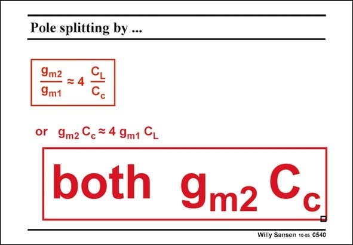

# SANSEN-0540 · Pole splitting by ...

章节：05 运算放大器的稳定性  
PDF 页：166；书本页：170；幻灯片编号：0540  
状态：unreviewed



## 对应教材讲解

### PDF 166 · 书本 170

This conclusion is what we have already reached previously. Increasing the load capacitance will force us to either increase the compensation capacitance or to increase the current in the second stage, as imposed by the stability requirement. Both help! Therefore, if during some design effort, the capacitance C does not provide c sufficient phase margin, then we have to increase the current in the second stage somewhat. This always helps!

## 公式／性能结论候选摘录

以下为规则截取的原文，尚未逐项判读。

- PDF 166: This conclusion is what we have already reached previously.
- PDF 166: Increasing the load capacitance will force us to either increase the compensation capacitance or to increase the current in the second stage, as imposed by the stability requirement.
- PDF 166: Therefore, if during some design effort, the capacitance C does not provide c sufficient phase margin, then we have to increase the current in the second stage somewhat.

## 曲线结论候选摘录

以下为规则截取的原文，尚未逐项判读。

- PDF 166: Therefore, if during some design effort, the capacitance C does not provide c sufficient phase margin, then we have to increase the current in the second stage somewhat.

## 原文条件与近似候选摘录

以下为规则截取的原文，尚未逐项判读。

（未由规则找到；不代表原页没有此类内容。）

## 幻灯片 OCR（未校正）

```text
Pole splitting by ...
9m2
9m1
or 9m2 Cc = 4 9m1 CL
both 9m2 Cc
Willy Sansen 10-05 0540
```

数学上下标、分数及正负号以原图为准。电路图已保留；未核对的连接不输出成可仿真 netlist。
