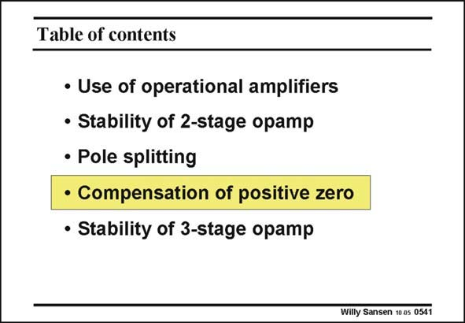

# SANSEN-0541 · Table of contents

章节：05 运算放大器的稳定性  
PDF 页：166；书本页：170；幻灯片编号：0541  
状态：unreviewed



## 对应教材讲解

### PDF 166 · 书本 170

Nevertheless, we do not want to increase the current in the second stage. All analog design is towards low-power design. This is why we have to find all possible techniques to remove this positive zero. They are listed next.

## 公式／性能结论候选摘录

以下为规则截取的原文，尚未逐项判读。

- PDF 166: Nevertheless, we do not want to increase the current in the second stage.

## 曲线结论候选摘录

以下为规则截取的原文，尚未逐项判读。

（未由规则找到；不代表原页没有此类内容。）

## 原文条件与近似候选摘录

以下为规则截取的原文，尚未逐项判读。

（未由规则找到；不代表原页没有此类内容。）

## 幻灯片 OCR（未校正）

```text
Table of contents
• Use of operational amplifiers
• Stability of 2-stage opamp
• Pole splitting
• Compensation of positive zero
• Stability of 3-stage opamp
Willy Sansen 10 as 0541
```

数学上下标、分数及正负号以原图为准。电路图已保留；未核对的连接不输出成可仿真 netlist。
