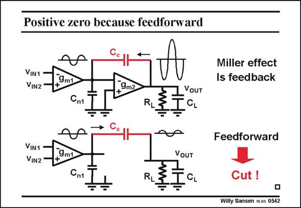

# SANSEN-0542 · Positive zero because feedforward

章节：05 运算放大器的稳定性  
PDF 页：167；书本页：171；幻灯片编号：0542  
状态：unreviewed



## 对应教材讲解

### PDF 167 · 书本 171

In order to understand how we can abolish the positive zero, we have to try to understand what its origin is, which adds another −90° phase shift. This is a result of the feedforward through the compensation capacitance. Indeed, the compensation capacitance is bidirectional after all, as most capacitances. This means that feedback current and feedforward current flow at the same time. The feedback current is the Miller effect current from output to input. It flows between two nodes which are opposite in phase. The feedforward current is only easy to see when we leave out the amplifier itself. We now notice a feedforward current through C which causes a small output signal which is in phase c with the input. This is the current which causes the zero. It is a positive zero because it provides an output signal which is of opposite phase compared with the amplified output signal. To abolish this positive zero, we have to make that compensation capacitance unidirectional. In other words, we have to put a transistor in series, which cuts the feedforward path.

## 公式／性能结论候选摘录

以下为规则截取的原文，尚未逐项判读。

（未由规则找到；不代表原页没有此类内容。）

## 曲线结论候选摘录

以下为规则截取的原文，尚未逐项判读。

- PDF 167: In order to understand how we can abolish the positive zero, we have to try to understand what its origin is, which adds another −90° phase shift.
- PDF 167: It flows between two nodes which are opposite in phase.
- PDF 167: We now notice a feedforward current through C which causes a small output signal which is in phase c with the input.
- PDF 167: It is a positive zero because it provides an output signal which is of opposite phase compared with the amplified output signal.

## 原文条件与近似候选摘录

以下为规则截取的原文，尚未逐项判读。

（未由规则找到；不代表原页没有此类内容。）

## 幻灯片 OCR（未校正）

```text
Positive zero because feedforward
VIN1
VIN2
9m1
9m2
Cn1
RL
ZYOUT
CL
VIN1
VIN2
9m1
Сn1
RL
=
VOUT
CL
Miller effect
Is feedback
Feedforward
Cut !
Willy Sansen 10.05 0542
```

数学上下标、分数及正负号以原图为准。电路图已保留；未核对的连接不输出成可仿真 netlist。
