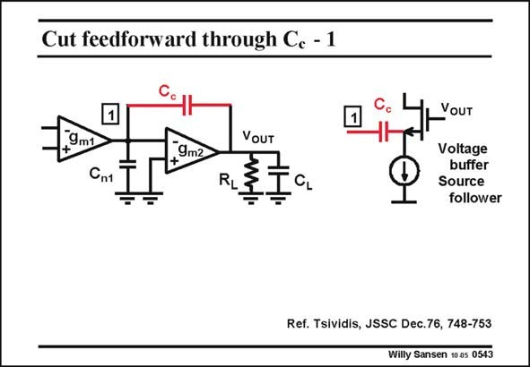

# SANSEN-0543 · Cut feedforward through Ce - 1

章节：05 运算放大器的稳定性  
PDF 页：167；书本页：171；幻灯片编号：0543  
状态：unreviewed



## 对应教材讲解

### PDF 167 · 书本 171

There are three ways to abolish the positive zero. For the first two, it is easy to see that the feedforward current is blocked. The third technique is more difficult to understand. The first technique consists of putting a source follower in series with the compensation capacitance. The feedback is still present but the feedforward current flows through the source follower to the positive supply, without affecting the output. Putting this source follower in the expression of the gain, gives as a result that the numerator has gone. There is no more zero. It is now an easy way to solve this problem. However, we need

### PDF 168 · 书本 172

some biasing current through the follower. This may not be the real solution for low-power design. The second technique is using a cascode instead. Its DC current is pulled out of the Source. A pMOST can be used as well, provided DC current is injected into the Source. Again, the AC feedback current can flow but not the feedforward current. The zero simply vanishes, but again at the cost of some additional biasing current. This problem can be solved as shown on the next slide. The third technique does not require any biasing current. This is why it is often preferred in low-power amplifiers.

## 公式／性能结论候选摘录

以下为规则截取的原文，尚未逐项判读。

- PDF 167: Putting this source follower in the expression of the gain, gives as a result that the numerator has gone.

## 曲线结论候选摘录

以下为规则截取的原文，尚未逐项判读。

（未由规则找到；不代表原页没有此类内容。）

## 原文条件与近似候选摘录

以下为规则截取的原文，尚未逐项判读。

- PDF 168: A pMOST can be used as well, provided DC current is injected into the Source.

## 幻灯片 OCR（未校正）

```text
Cut feedforward through Ce - 1
9m1
VOUT
9m2
Сп1
VOUT
Voltage
buffer
Source
follower
Ref. Tsividis, JSSC Dec. 76, 748-753
Willy Sansen 10.05 0543
```

数学上下标、分数及正负号以原图为准。电路图已保留；未核对的连接不输出成可仿真 netlist。
