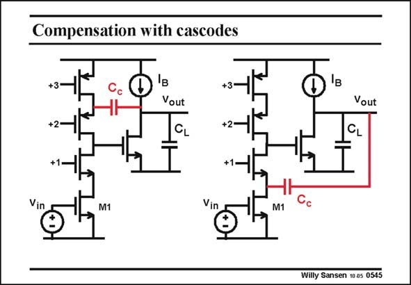

# SANSEN-0545 · Compensation with cascodes

章节：05 运算放大器的稳定性  
PDF 页：169；书本页：173；幻灯片编号：0545  
状态：unreviewed



## 对应教材讲解

### PDF 168 · 书本 172

A good example of the use of the second technique is shown in this slide. It is a telescopic cascode followed by a single-transistor amplifier as a second stage. The compensation capacitance C is no longer connected between the output and input of the c second stage. It takes a path through one of the cascodes, avoiding the positive zero. The second technique is used quite often as it does not require any additional biasing current!

### PDF 169 · 书本 173

It is not so easy to work out which cascode solution of the two to use. In principle, the second one is a little bit better as it takes the side of the input transistor. There are less higher-order poles and zeros in this case! Some designers take half the compensation capacitance to both sides, which is very similar indeed!

## 公式／性能结论候选摘录

以下为规则截取的原文，尚未逐项判读。

（未由规则找到；不代表原页没有此类内容。）

## 曲线结论候选摘录

以下为规则截取的原文，尚未逐项判读。

（未由规则找到；不代表原页没有此类内容。）

## 原文条件与近似候选摘录

以下为规则截取的原文，尚未逐项判读。

（未由规则找到；不代表原页没有此类内容。）

## 幻灯片 OCR（未校正）

```text
Compensation with cascodes
Vout
CL
Vout
CL
M1
1
Vin
M1
Willy Sansen 10 as 0545
```

数学上下标、分数及正负号以原图为准。电路图已保留；未核对的连接不输出成可仿真 netlist。
