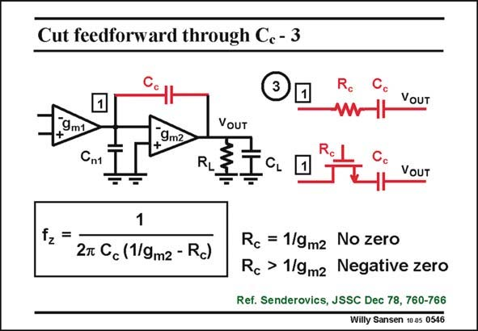

# SANSEN-0546 · Cut feedforward through Cc - 3

章节：05 运算放大器的稳定性  
PDF 页：169；书本页：173；幻灯片编号：0546  
状态：unreviewed



## 对应教材讲解

### PDF 169 · 书本 173

The third technique to abolish the positive zero, is to insert a small resistor R , in c series with C . c This resistor causes some cancellation of the effect of the feedforward by the feedback. The expression of the zero is now modified as shown. It is clear that for a resistance R equal to 1/g , the c m2 zero is at infinity. It has vanished. It is not so easy, however, to match a resistor to a g m value. Especially if the resistor is realized by means of a MOST in the linear region, then the matching is more difficult. There is a simple solution to this problem, however. We increase the size of the resistor. This zero now turns into a negative zero. In other words the minus sign in the expression of the zero compensates the minus sign in the gain expression. This negative zero is positioned between the negative poles and can therefore be used to compensate one of them.

## 公式／性能结论候选摘录

以下为规则截取的原文，尚未逐项判读。

- PDF 169: It is clear that for a resistance R equal to 1/g , the c m2 zero is at infinity.
- PDF 169: We increase the size of the resistor.
- PDF 169: In other words the minus sign in the expression of the zero compensates the minus sign in the gain expression.
- PDF 169: This negative zero is positioned between the negative poles and can therefore be used to compensate one of them.

## 曲线结论候选摘录

以下为规则截取的原文，尚未逐项判读。

（未由规则找到；不代表原页没有此类内容。）

## 原文条件与近似候选摘录

以下为规则截取的原文，尚未逐项判读。

（未由规则找到；不代表原页没有此类内容。）

## 幻灯片 OCR（未校正）

```text
Cut feedforward through Cc - 3
Ro
Cc
VOUT
9m1
Cn1
VOUT
9m2
VOUT
fz =
1
2r Cc (1/9m2 - Rc)
Rc = 1/9mz No zero
Rc > 1/9mz Negative zero
Ref. Senderovics, JSSC Dec 78, 760-766
Willy Sansen 10.05 0546
```

数学上下标、分数及正负号以原图为准。电路图已保留；未核对的连接不输出成可仿真 netlist。
