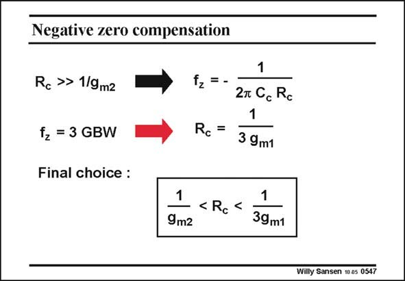

# SANSEN-0547 · Negative zero compensation

章节：05 运算放大器的稳定性  
PDF 页：170；书本页：174；幻灯片编号：0547  
状态：unreviewed



## 对应教材讲解

### PDF 169 · 书本 173

For a much larger resistor, the expression of the zero can be simplified to the one given in this slide. In order to be effective, we have to position this zero close to the GBW, for example at 2–3

### PDF 170 · 书本 174

times the GBW where the nondominant poles are. This yields a new expression for R , which is now c related to g instead of m1 gm2. We simply position R c between both the values obtained, with preference to be closer to 1/3g . m1 A numerical example will show that it is quite easy to position the resistor R as c indicated and that the tolerance on this resistor can be allowed to be quite large!

## 公式／性能结论候选摘录

以下为规则截取的原文，尚未逐项判读。

（未由规则找到；不代表原页没有此类内容。）

## 曲线结论候选摘录

以下为规则截取的原文，尚未逐项判读。

（未由规则找到；不代表原页没有此类内容。）

## 原文条件与近似候选摘录

以下为规则截取的原文，尚未逐项判读。

- PDF 169: For a much larger resistor, the expression of the zero can be simplified to the one given in this slide.

## 幻灯片 OCR（未校正）

```text
Negative zero compensation
Rc » 1/9mz
fz = 3 GBW
Final choice :
1
fz =-
2m Cc Rc
1
Rc=
3 9ml
1 <Rc<
1
9m2
39m1
Willy Sansen 10 05 0547
```

数学上下标、分数及正负号以原图为准。电路图已保留；未核对的连接不输出成可仿真 netlist。
