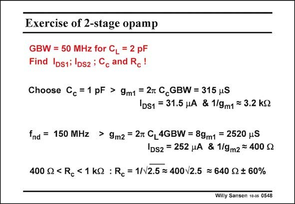

# SANSEN-0548 · Exercise of 2-stage opamp

章节：05 运算放大器的稳定性  
PDF 页：170；书本页：174；幻灯片编号：0548  
状态：unreviewed



## 对应教材讲解

### PDF 170 · 书本 174

As an example, let us take a two-stage opamp with a GBW of 50 MHz for a C L of 2 pF. We resort to the same design plan as before. We choose C to be 1 pF, half c the value of C . We will L refine this choice in the next Chapter. For a chosen C , the g c m1 is easily calculated. For a V −V of 0.2 V, its current GS T is ten times larger, or 31 mA. Note that 1/g is 3.2 kV m1 and 1/3g is about 1 kV. m1 For the second stage we recall that f must be three times higher than the GBW. Its g is nd m2 also readily calculated. The current is now eight times higher than the current in the input transistor or 252 mA and 1/g is 400 V. m2 We now have to position R between 400 V and 1 kV. Doing this on a logarithmic scale means c that we have to take a harmonic average. This gives about 640 V. The advantage of doing this is that the tolerance is larger and the same in both directions. This resistor can have an absolute tolerance of 60%, which makes it quite easy to achieve!

## 公式／性能结论候选摘录

以下为规则截取的原文，尚未逐项判读。

（未由规则找到；不代表原页没有此类内容。）

## 曲线结论候选摘录

以下为规则截取的原文，尚未逐项判读。

（未由规则找到；不代表原页没有此类内容。）

## 原文条件与近似候选摘录

以下为规则截取的原文，尚未逐项判读。

（未由规则找到；不代表原页没有此类内容。）

## 幻灯片 OCR（未校正）

```text
Exercise of 2-stage opamp
GBW = 50 MHz for CL = 2 pF
Find IostilDsz ; Cc and Rc!
Choose Cc =1 pF > 9m1 = 2m C GBW = 315 uS
IDS1 = 31.5 HA & 1/9m1 ~ 3.2 kS
fnd = 150 MHz > 9m2 = 2t CL4GBW = 89m1 = 2520 uS
IDS2 = 252 HA & 1/9m2 = 400 ₽
400 S2 < Rc < 1 KS : Rc = 1/N2.5 = 400/2.5 ≥ 640 $2 $ 60%
Willy Sansen 10-0s 0548
```

数学上下标、分数及正负号以原图为准。电路图已保留；未核对的连接不输出成可仿真 netlist。
