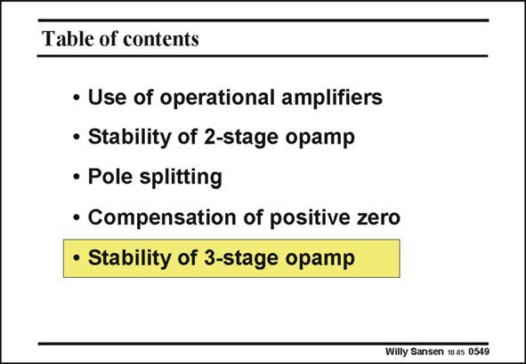

# SANSEN-0549 · Table of contents

章节：05 运算放大器的稳定性  
PDF 页：171；书本页：175；幻灯片编号：0549  
状态：unreviewed



## 对应教材讲解

### PDF 171 · 书本 175

As we have become familiar with the design of a twostage amplifier, we can easily extend this design method to three-stage amplifiers. Indeed, we will use the Miller effect twice. The resulting power consumption will be relatively high as we have to deal with the two non-dominant poles. In Chapter 10 on multistage amplifiers, we will present some more multistage amplifiers with much lower power consumption.

## 公式／性能结论候选摘录

以下为规则截取的原文，尚未逐项判读。

（未由规则找到；不代表原页没有此类内容。）

## 曲线结论候选摘录

以下为规则截取的原文，尚未逐项判读。

（未由规则找到；不代表原页没有此类内容。）

## 原文条件与近似候选摘录

以下为规则截取的原文，尚未逐项判读。

（未由规则找到；不代表原页没有此类内容。）

## 幻灯片 OCR（未校正）

```text
Table of contents
• Use of operational amplifiers
• Stability of 2-stage opamp
• Pole splitting
• Compensation of positive zero
• Stability of 3-stage opamp
Willy Sansen 10 os 0549
```

数学上下标、分数及正负号以原图为准。电路图已保留；未核对的连接不输出成可仿真 netlist。
