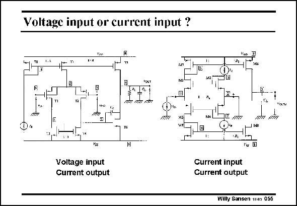

# SANSEN-055 · Voltage input or current input ?

章节：05 运算放大器的稳定性  
PDF 页：147；书本页：151；幻灯片编号：055  
状态：unreviewed



## 对应教材讲解

### PDF 147 · 书本 151

An opamp can have a voltage input or a current input. A voltage opamp has a differential voltage amplifier as an input (see left). It senses an input voltage. It usually contains a single-transistor as a second stage. The output itself is at a high impedance level, at least at low frequencies. It therefore acts as a current source for the load. As a result, we have a voltage-current amplifier or transconductance amplifier. It is often called Operational Transconductance Amplifier. The other amplifier (see right) has a current input, because the first transistor at the input is a cascode. It also has a current output. It is thus a current-current amplifier. Needless to say that the characteristics are very different. They are difficult to compare as they involve external resistors.

## 公式／性能结论候选摘录

以下为规则截取的原文，尚未逐项判读。

- PDF 147: It therefore acts as a current source for the load.
- PDF 147: As a result, we have a voltage-current amplifier or transconductance amplifier.
- PDF 147: It is thus a current-current amplifier.

## 曲线结论候选摘录

以下为规则截取的原文，尚未逐项判读。

- PDF 147: Needless to say that the characteristics are very different.

## 原文条件与近似候选摘录

以下为规则截取的原文，尚未逐项判读。

（未由规则找到；不代表原页没有此类内容。）

## 幻灯片 OCR（未校正）

```text
Voltage input or current input ?
I-n
touT
14 97
пт ti t
TCLTO
Voltage input
Current output
Current input
Gurrent output
Willy Sansen m4n 055
```

数学上下标、分数及正负号以原图为准。电路图已保留；未核对的连接不输出成可仿真 netlist。
