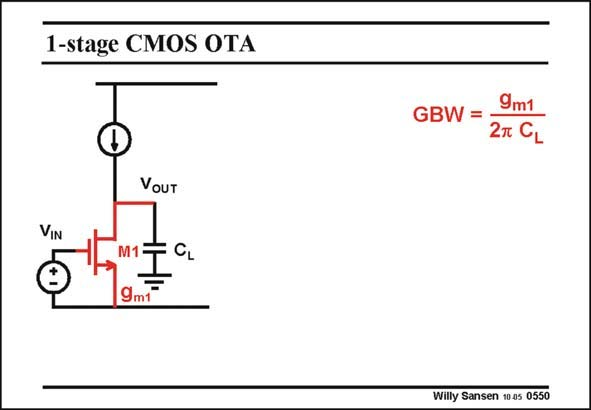

# SANSEN-0550 · 1-stage CMOS OTA

章节：05 运算放大器的稳定性  
PDF 页：171；书本页：175；幻灯片编号：0550  
状态：unreviewed



## 对应教材讲解

### PDF 171 · 书本 175

Before we expand towards a three-stage amplifier, let us review the principles of a single- and two-stage amplifier. A single-stage amplifier has only one high-impedance point, usually at the output. The load capacitance C therefore deter- L mines the GBW. It is also the input g m1 which determines this GBW.

## 公式／性能结论候选摘录

以下为规则截取的原文，尚未逐项判读。

- PDF 171: The load capacitance C therefore deter- L mines the GBW.

## 曲线结论候选摘录

以下为规则截取的原文，尚未逐项判读。

（未由规则找到；不代表原页没有此类内容。）

## 原文条件与近似候选摘录

以下为规则截取的原文，尚未逐项判读。

（未由规则找到；不代表原页没有此类内容。）

## 幻灯片 OCR（未校正）

```text
1-stage CMOS OTA
GBW =
9m1
2T CL
VOUT
VIN
9mF
Willy Sansen 10 as 0550
```

数学上下标、分数及正负号以原图为准。电路图已保留；未核对的连接不输出成可仿真 netlist。
