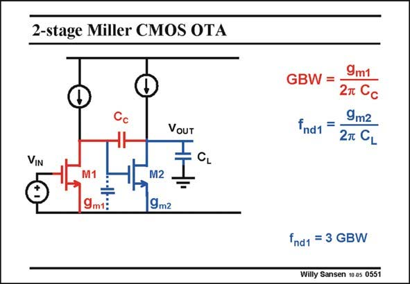

# SANSEN-0551 · 2-stage Miller CMOS OTA

章节：05 运算放大器的稳定性  
PDF 页：172；书本页：176；幻灯片编号：0551  
状态：unreviewed



## 对应教材讲解

### PDF 172 · 书本 176

A two-stage amplifier has two high-impedance points. These two points must be connected by a compensation capacitance C to carry C out polesplitting. This compensation capacitance therefore determines the GBW. Again it is the input g which determines this m1 GBW. The non-dominant pole is now determined by the load capacitance C at the L output.

## 公式／性能结论候选摘录

以下为规则截取的原文，尚未逐项判读。

- PDF 172: This compensation capacitance therefore determines the GBW.

## 曲线结论候选摘录

以下为规则截取的原文，尚未逐项判读。

（未由规则找到；不代表原页没有此类内容。）

## 原文条件与近似候选摘录

以下为规则截取的原文，尚未逐项判读。

（未由规则找到；不代表原页没有此类内容。）

## 幻灯片 OCR（未校正）

```text
2-stage Miller CMOS OTA
VOUT
VIN
CL
÷
9m1:
M2
19m2
9m1
GBW =
2т Cс
9m2
fnd1 =
27 CL
fnd1 = 3 GBW
Willy Sansen 10 os 0551
```

数学上下标、分数及正负号以原图为准。电路图已保留；未核对的连接不输出成可仿真 netlist。
