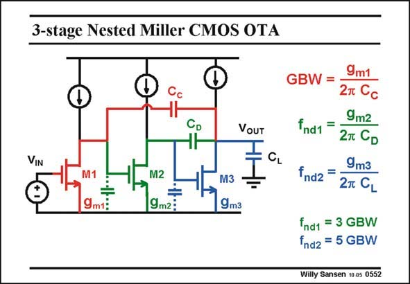

# SANSEN-0552 · 3-stage Nested Miller CMOS OTA

章节：05 运算放大器的稳定性  
PDF 页：172；书本页：176；幻灯片编号：0552  
状态：unreviewed



## 对应教材讲解

### PDF 172 · 书本 176

A three-stage amplifier has three high-impedance points. These three points must be connected by two compensation capacitances C and C C to carry out pole D splitting. The most efficient way to achieve this is to nest these two Miller capacitances, resulting in the Nested- Miller configuration. Capacitance C is the overall C compensation capacitance. This is why it determines the GBW. The other one merely leads to a non-dominant pole. Again, it is the input g which determines this GBW. There are now two non-dominant m1 poles. One of them is again determined by the load capacitance C , as for a two-stage amplifier. L The other is determined by the additional compensation capacitance C . The question now is, D how to deal with two non-dominant poles rather than one?

## 公式／性能结论候选摘录

以下为规则截取的原文，尚未逐项判读。

（未由规则找到；不代表原页没有此类内容。）

## 曲线结论候选摘录

以下为规则截取的原文，尚未逐项判读。

（未由规则找到；不代表原页没有此类内容。）

## 原文条件与近似候选摘录

以下为规则截取的原文，尚未逐项判读。

（未由规则找到；不代表原页没有此类内容。）

## 幻灯片 OCR（未校正）

```text
3-stage Nested Miller CMOS OTA
CL
9m1:
M2
9m2:
M3
9m3
GBW =
VOUT
VIN
9m2
Ind1 =
27 CD
9m3
fnd2 =
2т CL
fnd1 = 3 GBW
fnd2 = 5 GBW
Willy Sansen 10 as 0552
```

数学上下标、分数及正负号以原图为准。电路图已保留；未核对的连接不输出成可仿真 netlist。
