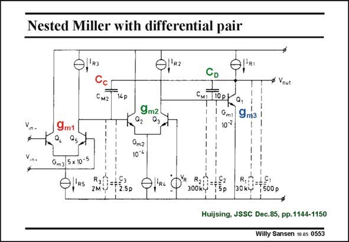

# SANSEN-0553 · Nested Miller with differential pair

章节：05 运算放大器的稳定性  
PDF 页：173；书本页：177；幻灯片编号：0553  
状态：unreviewed



## 对应教材讲解

### PDF 173 · 书本 177

We have to be careful spelling out the nested-Miller compensation of a threestage amplifier. The first two stages are normally realized by means of differential pairs. The first stage is a differential pair because we need a differential input. The second stage is realized by means of a differential pair because we need a non-inverting amplifier. Otherwise, capacitance C C would provide positive feedback! An alternative for this second stage would be a current mirror as explained in Chapter 10 on multistage amplifiers. One of the first bipolar realizations is shown in this slide. The transconductances and compensation capacitances are easily identified.

## 公式／性能结论候选摘录

以下为规则截取的原文，尚未逐项判读。

（未由规则找到；不代表原页没有此类内容。）

## 曲线结论候选摘录

以下为规则截取的原文，尚未逐项判读。

（未由规则找到；不代表原页没有此类内容。）

## 原文条件与近似候选摘录

以下为规则截取的原文，尚未逐项判读。

（未由规则找到；不代表原页没有此类内容。）

## 幻灯片 OCR（未校正）

```text
Nested Miller with differential pair
0,'a)
Смг
14р
CD
Сиі
Q.
• Vout
9m2
Gml
107₴
9 m3
Gm2
10°4
Gm3 5 x 10*°
0,'R5
2Mi
2.5p
300kY
0кD 15р
30 kg
P 1500р
Huijsing, JSSC Dec.85, pp.1144-1150
Willy Sansen 10 as 0553
```

数学上下标、分数及正负号以原图为准。电路图已保留；未核对的连接不输出成可仿真 netlist。
