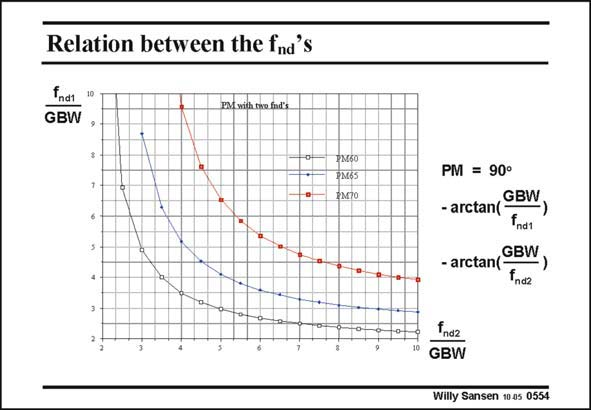

# SANSEN-0554 · Relation between the fnd's

章节：05 运算放大器的稳定性  
PDF 页：173；书本页：177；幻灯片编号：0554  
状态：unreviewed



## 对应教材讲解

### PDF 173 · 书本 177

If two non-dominant poles contribute to the phase margin, then we have to extend the expression of the Phase Margin PM with another pole, as given in this slide. The curves for equal PM of respectively 60°, 65° and 70° are now easily calculated. Taking the tangent of the expression of PM allows the simplification of the calculations! Let us focus on the relationship between the two non-dominant poles f for a PM of 60°. nd It is clear that if we have a f fairly close to the GBW. The other one will then be far away. nd They can also be at an equal distance from the GBW, at about 3.5–4 times the GBW. Normally, one f is put at about 3 times the GBW and the other one at about 5 times. We nd obviously prefer to have the 5×GBW at the output because the higher frequency requires the higher current. It is more advantageous to have the higher current at the output. More current can be taken out by the load. A good choice for a PM of 60° is therefore a ratio f /GBW of three for the middle pole and nd five for the output pole.

## 公式／性能结论候选摘录

以下为规则截取的原文，尚未逐项判读。

- PDF 173: The curves for equal PM of respectively 60°, 65° and 70° are now easily calculated.
- PDF 173: The other one will then be far away. nd They can also be at an equal distance from the GBW, at about 3.5–4 times the GBW.
- PDF 173: A good choice for a PM of 60° is therefore a ratio f /GBW of three for the middle pole and nd five for the output pole.

## 曲线结论候选摘录

以下为规则截取的原文，尚未逐项判读。

- PDF 173: If two non-dominant poles contribute to the phase margin, then we have to extend the expression of the Phase Margin PM with another pole, as given in this slide.
- PDF 173: The curves for equal PM of respectively 60°, 65° and 70° are now easily calculated.

## 原文条件与近似候选摘录

以下为规则截取的原文，尚未逐项判读。

（未由规则找到；不代表原页没有此类内容。）

## 幻灯片 OCR（未校正）

```text
Relation between the fnd's
fndt
GBW
PM with tho fnd's
PN50
PM65
PM70
PM = 90°
- arctan(GBW
fnd1
,GBW
- arctang
fndz
nd2
GBW
Willy Sansen 10.05 0554
```

数学上下标、分数及正负号以原图为准。电路图已保留；未核对的连接不输出成可仿真 netlist。
