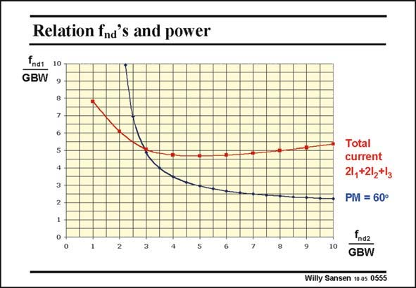

# SANSEN-0555 · Relation fnd's and power

章节：05 运算放大器的稳定性  
PDF 页：174；书本页：178；幻灯片编号：0555  
状态：unreviewed



## 对应教材讲解

### PDF 174 · 书本 178

If we select non-dominant poles which are widely different, then the current required to position the higher-frequency pole may become excessive. To illustrate this point, the relationship between the two non-dominant poles is plotted in this slide, followed by a plot of the total current consumption. This shows that once we select a higher-frequency pole beyond 6–7 times the GBW, the total power consumption increases. There is a minimum indeed around values of 5×GBW, requiring the other pole to be around 3×GBW, exactly as suggested in the previous slide. The minimum is not very pronounced, however. The designer is still relatively free in his choice of non-dominant pole positions.

## 公式／性能结论候选摘录

以下为规则截取的原文，尚未逐项判读。

- PDF 174: This shows that once we select a higher-frequency pole beyond 6–7 times the GBW, the total power consumption increases.

## 曲线结论候选摘录

以下为规则截取的原文，尚未逐项判读。

- PDF 174: To illustrate this point, the relationship between the two non-dominant poles is plotted in this slide, followed by a plot of the total current consumption.

## 原文条件与近似候选摘录

以下为规则截取的原文，尚未逐项判读。

（未由规则找到；不代表原页没有此类内容。）

## 幻灯片 OCR（未校正）

```text
Relation fnd's and power
fndt
GBW
10
Totall
current
21, +212+/3
PM = 60°
10
Ind2
GBW
Willy Sansen 10 0s 0555
```

数学上下标、分数及正负号以原图为准。电路图已保留；未核对的连接不输出成可仿真 netlist。
