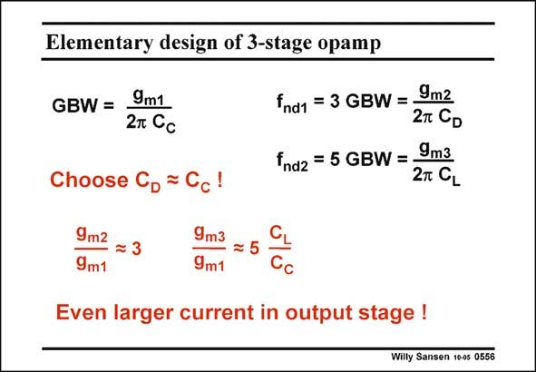

# SANSEN-0556 · Elementary design of 3-stage opamp

章节：05 运算放大器的稳定性  
PDF 页：174；书本页：178；幻灯片编号：0556  
状态：unreviewed



## 对应教材讲解

### PDF 174 · 书本 178

The design plan itself is then fairly straightforward. Remember that for the two-stage amplifier, we have chosen the value of the compensation capacitance. It was taken to be about 2–3 times smaller than the load capacitance. For this three-stage amplifier we adopt a similar strategy. Both compensation capacitances are chosen to be equal, and to be about 2–3 times smaller than the load capacitance. Of course, they can be taken differently. It is clear that according to the equations describing the stability, we would obtain the same Phase Margin. It is not clear yet however, how this would affect some other specifications. Having chosen the two compensation capacitances, we simply have to solve three equations with three variables g , g and g . m1 m2 m3

## 公式／性能结论候选摘录

以下为规则截取的原文，尚未逐项判读。

- PDF 174: Both compensation capacitances are chosen to be equal, and to be about 2–3 times smaller than the load capacitance.

## 曲线结论候选摘录

以下为规则截取的原文，尚未逐项判读。

- PDF 174: It is clear that according to the equations describing the stability, we would obtain the same Phase Margin.

## 原文条件与近似候选摘录

以下为规则截取的原文，尚未逐项判读。

（未由规则找到；不代表原页没有此类内容。）

## 幻灯片 OCR（未校正）

```text
Elementary design of 3-stage opamp
GBW =
9m1
2т Сс
Choose Cp = Cc!
9m2 = 3
9m1
9m3
9m1
fnd1 = 3 GBW =.
9m2
2T CD
fnd2 = 5 GBW =
9m3
2T CL
CL
5
Cc
Even larger current in output stage !
Willy Sansen 10-05 0556
```

数学上下标、分数及正负号以原图为准。电路图已保留；未核对的连接不输出成可仿真 netlist。
