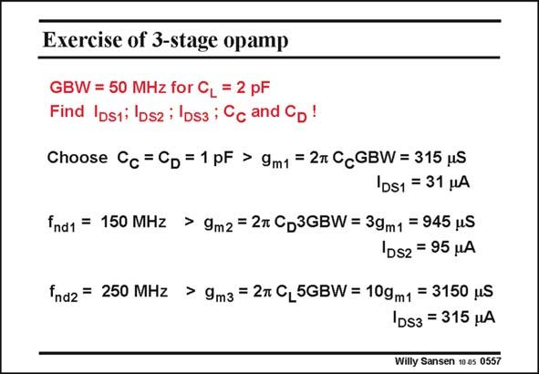

# SANSEN-0557 · Exercise of 3-stage opamp

章节：05 运算放大器的稳定性  
PDF 页：175；书本页：179；幻灯片编号：0557  
状态：unreviewed



## 对应教材讲解

### PDF 175 · 书本 179

As an example, let us design an opamp with the GBW and C given in this slide. L The compensation capacitances have been set at half the load capacitance or 1 pF. The g ’s are now m easily calculated. It is obvious that because of the higher-frequency pole f at nd2 the output, the output transistor M3 also consumes most of the current.

## 公式／性能结论候选摘录

以下为规则截取的原文，尚未逐项判读。

（未由规则找到；不代表原页没有此类内容。）

## 曲线结论候选摘录

以下为规则截取的原文，尚未逐项判读。

（未由规则找到；不代表原页没有此类内容。）

## 原文条件与近似候选摘录

以下为规则截取的原文，尚未逐项判读。

（未由规则找到；不代表原页没有此类内容。）

## 幻灯片 OCR（未校正）

```text
Exercise of 3-stage opamp
GBW = 50 MHz for CL = 2 pF
Find Iosti losz i lDsa ; Cc and CD !
Choose Cc = Cp = 1pF > 9m1 = 2t CcGBW = 315 uS
|DS1 = 31 HA
fnd1 = 150 MHz > 9m2 = 2m CD3GBW = 39m1 = 945 MS
D52 = 95 MA
fnd2 = 250 MHz > 9m3 = 2t CL5GBW = 10gm1 = 3150 uS
|DS3 = 315 uA
Willy Sansen 10 0s 0557
```

数学上下标、分数及正负号以原图为准。电路图已保留；未核对的连接不输出成可仿真 netlist。
