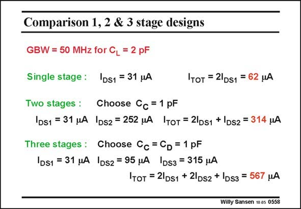

# SANSEN-0558 · Comparison 1, 2 & 3 stage designs

章节：05 运算放大器的稳定性  
PDF 页：175；书本页：179；幻灯片编号：0558  
状态：unreviewed



## 对应教材讲解

### PDF 175 · 书本 179

For sake of comparison, we have designed a single-stage, two-stage and a three-stage opamp for the same specifications. It is obvious that the single-stage opamp is the champion in power consumption. The addition of compensation capacitances invariably leads to excessive power consumption. However, a single-stage opamp does not provide a lot of gain. The addition of cascodes and gain boosting reduces the output swing. This is where a two-stage Miller opamp offers considerable advantages. A three-stage amplifier will be used whenever we need a class-AB output stage. Also when the supply voltage is so low that there is no room for cascodes, we may have to go for cascading rather than cascoding!

## 公式／性能结论候选摘录

以下为规则截取的原文，尚未逐项判读。

- PDF 175: However, a single-stage opamp does not provide a lot of gain.
- PDF 175: The addition of cascodes and gain boosting reduces the output swing.

## 曲线结论候选摘录

以下为规则截取的原文，尚未逐项判读。

（未由规则找到；不代表原页没有此类内容。）

## 原文条件与近似候选摘录

以下为规则截取的原文，尚未逐项判读。

（未由规则找到；不代表原页没有此类内容。）

## 幻灯片 OCR（未校正）

```text
Comparison 1, 2 & 3 stage designs
GBW = 50 MHz for CL = 2 pF
Single stage: |DS1 = 31 MA
'Tот = 2|DS1 = 62 HA
Two stages : Choose Cc =1 pF
|DS1 = 31 MA |DS2 = 252 MA ITOT = 21DS1 + |DS2 = 314 MA
Three stages : Choose Cc = CD = 1 pF
|DS1 = 31 MA |DS2 = 95 HA |DS3 = 315 MA
Iтот = 2|DS1 + 2|Ds2 + Ds3 = 567 MA
Willy Sansen 10 es 0558
```

数学上下标、分数及正负号以原图为准。电路图已保留；未核对的连接不输出成可仿真 netlist。
