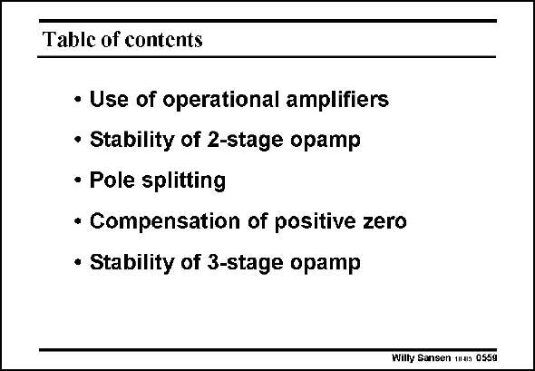

# SANSEN-0559 · Table of contents

章节：05 运算放大器的稳定性  
PDF 页：176；书本页：180；幻灯片编号：0559  
状态：unreviewed



## 对应教材讲解

### PDF 176 · 书本 180

We have now acquired sufficient knowledge about the stability of an operational transconductance amplifier, to be able to implement it by means of MOSTs or bipolar transistors. This is discussed in the next Chapter.

## 公式／性能结论候选摘录

以下为规则截取的原文，尚未逐项判读。

（未由规则找到；不代表原页没有此类内容。）

## 曲线结论候选摘录

以下为规则截取的原文，尚未逐项判读。

（未由规则找到；不代表原页没有此类内容。）

## 原文条件与近似候选摘录

以下为规则截取的原文，尚未逐项判读。

（未由规则找到；不代表原页没有此类内容。）

## 幻灯片 OCR（未校正）

```text
Table of contents
• Use of operational amplifiers
• Stability of 2-stage opamp
• Pole splitting
• Compensation of positive zero
• Stability of 3-stage opamp
Willy Sansen tan 0559
```

数学上下标、分数及正负号以原图为准。电路图已保留；未核对的连接不输出成可仿真 netlist。
