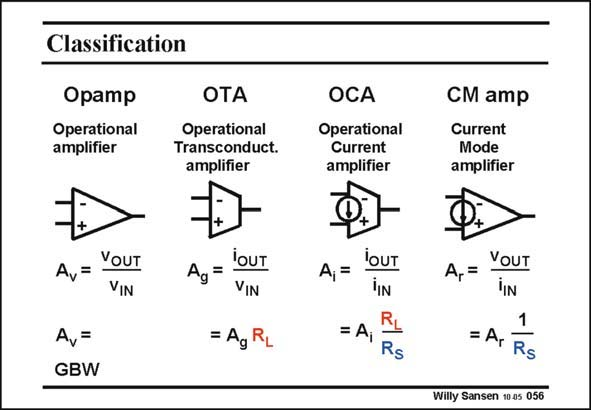

# SANSEN-056 · Classification

章节：05 运算放大器的稳定性  
PDF 页：147；书本页：151；幻灯片编号：056  
状态：unreviewed



## 对应教材讲解

### PDF 147 · 书本 151

All possible combinations for voltage/current input and output are depicted in this slide. The operational transconductance amplifier is the second one. If we add a (class AB) output to this OTA, we obtain a voltage output. This is now a conventional operational amplifier. Its voltage gain is normally very high. It is not that easy to compare an OTA to an opamp, as the voltage gain of an OTA depends on the load R . L Both amplifiers can be realized with a current input. They have different names depending on who is talking. In order to compare a current input amplifier to a voltage-input amplifier is more difficult.

### PDF 148 · 书本 152

Indeed, sometimes a current-input amplifier is driven from an input voltage source, having a source resistance R . Clearly, this resistance shows up in the comparison with a voltage amplifier. S Obviously the smaller we can make R , the better. S We will start with an OTA.

## 公式／性能结论候选摘录

以下为规则截取的原文，尚未逐项判读。

- PDF 147: Its voltage gain is normally very high.
- PDF 147: It is not that easy to compare an OTA to an opamp, as the voltage gain of an OTA depends on the load R .
- PDF 147: They have different names depending on who is talking.

## 曲线结论候选摘录

以下为规则截取的原文，尚未逐项判读。

（未由规则找到；不代表原页没有此类内容。）

## 原文条件与近似候选摘录

以下为规则截取的原文，尚未逐项判读。

（未由规则找到；不代表原页没有此类内容。）

## 幻灯片 OCR（未校正）

```text
Classification
Оpamp
Operational
amplifier
OTA
Operational
Transconduct.
amplifier
A,=
YOUT
VIN
Av=
GBW
=
YOUT
VIN
= AgR
OCA
Operational
Current
amplifier
CМ amp
Current
Mode
amplifier
A,=
'OUT
'IN
= Aj
R
Rs
A,=
VOUT
TIN
1
= A,
Rs
Willy Sansen 10 as 056
```

数学上下标、分数及正负号以原图为准。电路图已保留；未核对的连接不输出成可仿真 netlist。
