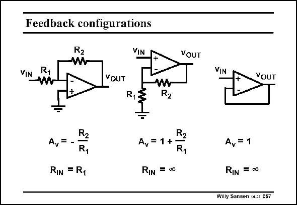

# SANSEN-057 · Feedback configurations

章节：05 运算放大器的稳定性  
PDF 页：148；书本页：152；幻灯片编号：057  
状态：unreviewed



## 对应教材讲解

### PDF 148 · 书本 152

Opamps and OTA’s are used with feedback. Normally, resistors are used, but also (switched) capacitors and sometimes even inductors. Some easy configurations are sketched in this slide. The first one is the inverting amplifier, the second one the non-inverting amplifier. However, they have all gains which are easy to set precisely. They all have different input resistances. The last configuration is a buffer. The gain is unity but the input impedance is very high and the output impedance low.

## 公式／性能结论候选摘录

以下为规则截取的原文，尚未逐项判读。

- PDF 148: The gain is unity but the input impedance is very high and the output impedance low.

## 曲线结论候选摘录

以下为规则截取的原文，尚未逐项判读。

（未由规则找到；不代表原页没有此类内容。）

## 原文条件与近似候选摘录

以下为规则截取的原文，尚未逐项判读。

（未由规则找到；不代表原页没有此类内容。）

## 幻灯片 OCR（未校正）

```text
Feedback configurations
VIN
VOUT
VOUT
W
R13
A, = -
RIN = R1
Av = 1 +
RIN = ∞0
R
R1
VIN
VOUT
A, = 1
RIN =00
Willy Sansen 10a5 057
```

数学上下标、分数及正负号以原图为准。电路图已保留；未核对的连接不输出成可仿真 netlist。
