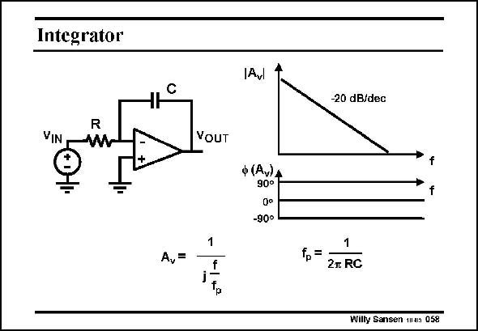

# SANSEN-058 · Integrator

章节：05 运算放大器的稳定性  
PDF 页：148；书本页：152；幻灯片编号：058  
状态：unreviewed



## 对应教材讲解

### PDF 148 · 书本 152

Opamps are used to make all kinds of filters as well. The simplest one is probably the integrator. At ever lower frequencies, the gain increases continuously until the value is reached of the open-loop gain of the opamp itself. At all other frequencies, a constant slope is obtained of −20 dB/decade, and a constant phase shift of 90°.

## 公式／性能结论候选摘录

以下为规则截取的原文，尚未逐项判读。

- PDF 148: At ever lower frequencies, the gain increases continuously until the value is reached of the open-loop gain of the opamp itself.

## 曲线结论候选摘录

以下为规则截取的原文，尚未逐项判读。

- PDF 148: At all other frequencies, a constant slope is obtained of −20 dB/decade, and a constant phase shift of 90°.

## 原文条件与近似候选摘录

以下为规则截取的原文，尚未逐项判读。

（未由规则找到；不代表原页没有此类内容。）

## 幻灯片 OCR（未校正）

```text
Integrator
VIN
YOUT
Av=
f
[Avl
ф(А.)A
90°
Qo
-90°
-20 dB/dec
1
fp=
2л RC
Willy Sansen m4n 058
```

数学上下标、分数及正负号以原图为准。电路图已保留；未核对的连接不输出成可仿真 netlist。
