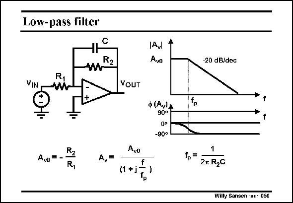

# SANSEN-059 · Low-pass filter

章节：05 运算放大器的稳定性  
PDF 页：149；书本页：153；幻灯片编号：059  
状态：unreviewed



## 对应教材讲解

### PDF 149 · 书本 153

A first-order low-pass filter is an integrator with a resistor across the capacitor. It is also called a lossy integrator. At lower and lower frequencies, the gain is now set by the ratio of the two resistors. At the pole frequency, or the bandwidth, the phase shift is exactly halfway between zero and 90°, which is 45°. Note that a first-order decreasing characteristic, which is called a pole, always shows a slope of −20 dB/decade and −90° phase shift.

## 公式／性能结论候选摘录

以下为规则截取的原文，尚未逐项判读。

- PDF 149: At lower and lower frequencies, the gain is now set by the ratio of the two resistors.
- PDF 149: At the pole frequency, or the bandwidth, the phase shift is exactly halfway between zero and 90°, which is 45°.

## 曲线结论候选摘录

以下为规则截取的原文，尚未逐项判读。

- PDF 149: At the pole frequency, or the bandwidth, the phase shift is exactly halfway between zero and 90°, which is 45°.
- PDF 149: Note that a first-order decreasing characteristic, which is called a pole, always shows a slope of −20 dB/decade and −90° phase shift.

## 原文条件与近似候选摘录

以下为规则截取的原文，尚未逐项判读。

（未由规则找到；不代表原页没有此类内容。）

## 幻灯片 OCR（未校正）

```text
Low-pass filter
VIN
Aw = -
Av=
IAV
Avo
VOUT
ф (Av)А
90°
0°
-90°
AvD
f
(1 +j
-20 dB/dec
$
f.=
2m R2C
Willy Sansen man 059
```

数学上下标、分数及正负号以原图为准。电路图已保留；未核对的连接不输出成可仿真 netlist。
