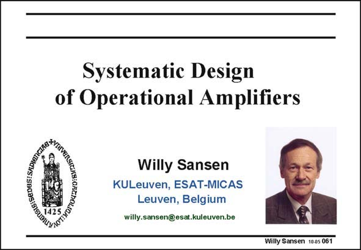

# SANSEN-061 · Slide 061

章节：06 运算放大器的系统化设计  
PDF 页：177；书本页：181；幻灯片编号：061  
状态：unreviewed



## 对应教材讲解

### PDF 177 · 书本 181

In the previous Chapter we learned all we need about the stability of an operational transconductance amplifier, to be able to implement it by means of MOST devices. Now we would like to refine the design plan. Up till now we have arbitrarily chosen the compensation capacitances. The question is, how can we improve on that? Finally, we have now focused on a few specifications only, which are the GBW and the Phase Margin. Surely there are many more specifications. They are elaborated on in this Chapter.

## 公式／性能结论候选摘录

以下为规则截取的原文，尚未逐项判读。

（未由规则找到；不代表原页没有此类内容。）

## 曲线结论候选摘录

以下为规则截取的原文，尚未逐项判读。

- PDF 177: Finally, we have now focused on a few specifications only, which are the GBW and the Phase Margin.

## 原文条件与近似候选摘录

以下为规则截取的原文，尚未逐项判读。

（未由规则找到；不代表原页没有此类内容。）

## 幻灯片 OCR（未校正）

```text
Systematic Design
of Operational Amplifiers
Willy Sansen
KULeuven, ESAT-MICAS
Leuven, Belgium
willy.sansen@esat.kuleuven.be
Willy Sansen 1005 061
```

数学上下标、分数及正负号以原图为准。电路图已保留；未核对的连接不输出成可仿真 netlist。
