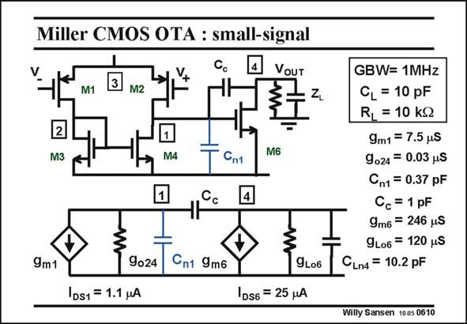

# SANSEN-0610 · Miller CMOS OTA : small-signal

章节：06 运算放大器的系统化设计  
PDF 页：182；书本页：186；幻灯片编号：0610  
状态：unreviewed



## 对应教材讲解

### PDF 181 · 书本 185

In order to be able to calculate the gains, etc, we draw on the small signal equivalent circuit. It is shown below. The 4-transistor input stage is represented by the g generator, and the second stage by the m1 g generator. m6

### PDF 182 · 书本 186

The input stage has an output resistance which is the inverse of g , which is 024 a short way of stating g +g . o2 o4 This circuit can be simplified to a two-node circuit with two transconductances and a RC circuit from each node to ground. Obviously, there are two nodes, but also a compensation capacitance C to split them up. c All values given are for 1 MHz/10 pF realization, which will be used for all numerical examples from now on. These values have also been used for the pole-zero position diagrams in the previous Chapter. How exactly these values have been obtained, will be explained when we discuss the design plans next.

## 公式／性能结论候选摘录

以下为规则截取的原文，尚未逐项判读。

（未由规则找到；不代表原页没有此类内容。）

## 曲线结论候选摘录

以下为规则截取的原文，尚未逐项判读。

（未由规则找到；不代表原页没有此类内容。）

## 原文条件与近似候选摘录

以下为规则截取的原文，尚未逐项判读。

（未由规则找到；不代表原页没有此类内容。）

## 幻灯片 OCR（未校正）

```text
Miller CMOS OTA : small-signal
Cc
VOUT
M1
3
M2
ZL
2
M3
M4
Cn1
M6
Cc
4
9m1
9024
Сп1 9m6
9L06
|DS1 = 1.1 HA
1D56 = 25 HA
GBW= 1MHz
CL = 10 pF
RL = 10 KQ
9m1 = 7.5 uS
9 024 = 0.03 uS
Cn1 = 0.37 pF
Cc = 1 pF
9m6 = 246 uS
9L06 = 120 uS
CLn4 = 10.2 pF
Willy Sansen 1005 0610
```

数学上下标、分数及正负号以原图为准。电路图已保留；未核对的连接不输出成可仿真 netlist。
