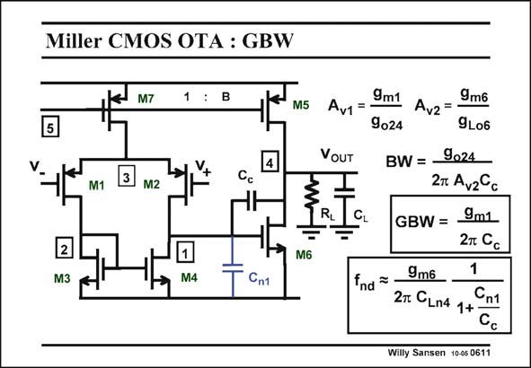

# SANSEN-0611 · Miller CMOS OTA : GBW

章节：06 运算放大器的系统化设计  
PDF 页：182；书本页：186；幻灯片编号：0611  
状态：unreviewed



## 对应教材讲解

### PDF 182 · 书本 186

The gains are now easily calculated. We have two stages so we have two gains A v1 and A , and a total gain A . v2 v The bandwidth is obviously due to the Miller effect of capacitance C , as c expected. The GBW is now the product of both. It is exactly what we have anticipated. Also, the non-dominant pole is again what we have derived in the previous Chapter. Again, normally C c is about 3 times C . n1

## 公式／性能结论候选摘录

以下为规则截取的原文，尚未逐项判读。

- PDF 182: We have two stages so we have two gains A v1 and A , and a total gain A . v2 v The bandwidth is obviously due to the Miller effect of capacitance C , as c expected.

## 曲线结论候选摘录

以下为规则截取的原文，尚未逐项判读。

（未由规则找到；不代表原页没有此类内容。）

## 原文条件与近似候选摘录

以下为规则截取的原文，尚未逐项判读。

（未由规则找到；不代表原页没有此类内容。）

## 幻灯片 OCR（未校正）

```text
Miller CMOS OTA : GBW
M7
1
B
M5
M1
M2
2
M3
M6
M4
Cnt
Av1 =
9m1 Av2=*
9m6
9024
9L06
VOUT
BW =_9024
27 Avz°c
RL
GBW = _9m1
2т Cс
fnd =-
9m6
1
2т CLn4 1+
Cn1
Willy Sansen 10-0s 0611
```

数学上下标、分数及正负号以原图为准。电路图已保留；未核对的连接不输出成可仿真 netlist。
