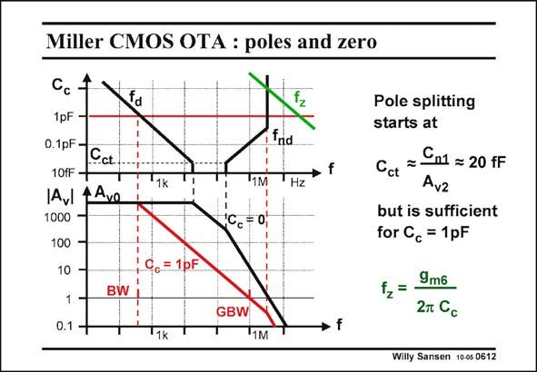

# SANSEN-0612 · Miller CMOS OTA : poles and zero

章节：06 运算放大器的系统化设计  
PDF 页：183；书本页：187；幻灯片编号：0612  
状态：unreviewed



## 对应教材讲解

### PDF 182 · 书本 186

For this particular amplifier, the pole-zero position and Bode diagrams are sketched in this slide. For zero C , two poles are found, which are clearly too close together. Peaking would occur c if feedback is applied. This capacitance has been increased to about 1 pF. In this case the dominant pole has decreased a lot but what is more important is that the non-dominant pole has moved out until

### PDF 183 · 书本 187

it is almost three times the GBW. The zero is still too far to bother us! The result is a CMOS Miller OTA with a gain of about 3000 or 70 dB, a bandwidth of about 300 Hz and a GBW of 1 MHz. The total power consumption is 27 mA. Its FOM is therefore 370 MHzpF/mA which is an excellent value for a two-stage amplifier. Actually, anything that is better than 100 is good!

## 公式／性能结论候选摘录

以下为规则截取的原文，尚未逐项判读。

- PDF 182: This capacitance has been increased to about 1 pF.
- PDF 182: In this case the dominant pole has decreased a lot but what is more important is that the non-dominant pole has moved out until
- PDF 183: The result is a CMOS Miller OTA with a gain of about 3000 or 70 dB, a bandwidth of about 300 Hz and a GBW of 1 MHz.
- PDF 183: Its FOM is therefore 370 MHzpF/mA which is an excellent value for a two-stage amplifier.

## 曲线结论候选摘录

以下为规则截取的原文，尚未逐项判读。

- PDF 182: For this particular amplifier, the pole-zero position and Bode diagrams are sketched in this slide.
- PDF 182: Peaking would occur c if feedback is applied.

## 原文条件与近似候选摘录

以下为规则截取的原文，尚未逐项判读。

（未由规则找到；不代表原页没有此类内容。）

## 幻灯片 OCR（未校正）

```text
Miller CMOS OTA : poles and zero
Cc
1pF -
0.1pF.
Cct
10fF-
IAVI 4AVO
1000
100
10
1
BW
0.1
Td
"1k
fnd
'Hz
1M
Cc = 0;
C6 = 1pF
GBW
1k
"1M
Pole splitting
starts at
Cn1 = 20 FF
Cct
Avz
but is sufficient
for Cc = 1pF
12= -
9m6
2m Cc
Willy Sansen 10-05 0612
```

数学上下标、分数及正负号以原图为准。电路图已保留；未核对的连接不输出成可仿真 netlist。
