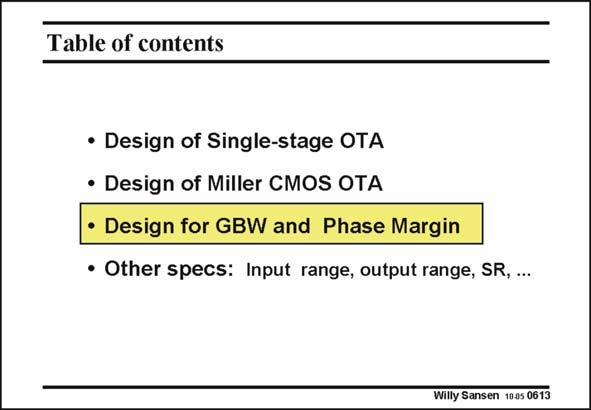

# SANSEN-0613 · Table of contents

章节：06 运算放大器的系统化设计  
PDF 页：183；书本页：187；幻灯片编号：0613  
状态：unreviewed



## 对应教材讲解

### PDF 183 · 书本 187

The question remains. How has this Miller OTA been designed. Can we do better? Can we obtain a better FOM? We will see that there are three ways to obtain the same optimum in terms of minimum power consumption. Any design plan can now be adopted.

## 公式／性能结论候选摘录

以下为规则截取的原文，尚未逐项判读。

（未由规则找到；不代表原页没有此类内容。）

## 曲线结论候选摘录

以下为规则截取的原文，尚未逐项判读。

（未由规则找到；不代表原页没有此类内容。）

## 原文条件与近似候选摘录

以下为规则截取的原文，尚未逐项判读。

（未由规则找到；不代表原页没有此类内容。）

## 幻灯片 OCR（未校正）

```text
Table of contents
• Design of Single-stage OTA
• Design of Miller CMOS OTA
• Design for GBW and Phase Margin
• Other specs: Input range, output range, SR, ...
Willy Sansen 1005 0613
```

数学上下标、分数及正负号以原图为准。电路图已保留；未核对的连接不输出成可仿真 netlist。
