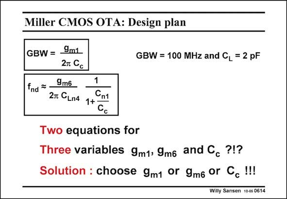

# SANSEN-0614 · Miller CMOS OTA: Design plan

章节：06 运算放大器的系统化设计  
PDF 页：184；书本页：188；幻灯片编号：0614  
状态：unreviewed



## 对应教材讲解

### PDF 183 · 书本 187

Since we only have two specifications up till now, we only have two equations, one for the GBW and one for the stability. As a result, when we require a specific GBW for a specific C , we simply have to solve these L two equations. The problem is that we have three variables. They are the current in the first stage (or g ), m1 the current in the second stage (or g ) and the compensation capacitance C . m6 c Up till now, we have chosen the compensation capacitance, which allows us to solve the two equations, since they only have two variables g and g . m1 m6 This is indeed the first possible design plan.

### PDF 184 · 书本 188

There are two more design plans, i.e. choosing the g first and then solve m1 the two equations, or choosing the g first and then m6 solve the two equations. All three design plans lead to the same optimum. The same two equations can obviously be used in any direction. One could wonder, for example, how much GBW can be obtained for a C of 5 pF with only L 0.2 mA? We also ask, how much load capacitance can we drive with 1 mA for a GBW of 200 MHz?

## 公式／性能结论候选摘录

以下为规则截取的原文，尚未逐项判读。

- PDF 183: As a result, when we require a specific GBW for a specific C , we simply have to solve these L two equations.

## 曲线结论候选摘录

以下为规则截取的原文，尚未逐项判读。

（未由规则找到；不代表原页没有此类内容。）

## 原文条件与近似候选摘录

以下为规则截取的原文，尚未逐项判读。

（未由规则找到；不代表原页没有此类内容。）

## 幻灯片 OCR（未校正）

```text
Miller CMOS OTA: Design plan
GBW = 9m1
GBW = 100 MHz and CL = 2 pF
2T Cc
fnd = -
9m6
2T CLn4
Cn1
1+-
Cc
Two equations for
Three variables 9m1, 9m6 and Cc?!?
Solution : choose 9m1 or 9m6 or Cc!!!!
Willy Sansen 10-0s 0614
```

数学上下标、分数及正负号以原图为准。电路图已保留；未核对的连接不输出成可仿真 netlist。
