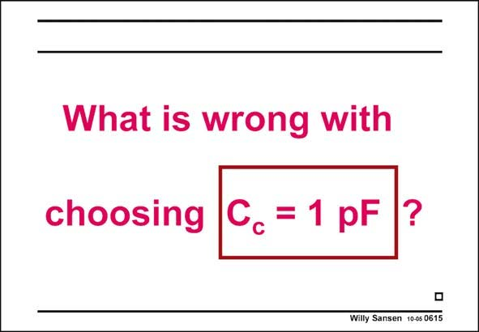

# SANSEN-0615 · Slide 0615

章节：06 运算放大器的系统化设计  
PDF 页：184；书本页：188；幻灯片编号：0615  
状态：unreviewed



## 对应教材讲解

### PDF 184 · 书本 188

All three design plans lead to the same optimum indeed. There is a slight preference for choosing the compensation capacitance C c first as this capacitance can only have a small range of values. Indeed, it cannot be smaller than about 3×C . n1 On the other hand, it cannot be larger than the load capacitance C divided L by 2–3. It is now fairly easy to choose this compensation capacitance about right. This is why so many designers simply choose C as a starting point for their design procedure. c Of course, even better is to try a few different capacitance values! Let us work out an example first!

## 公式／性能结论候选摘录

以下为规则截取的原文，尚未逐项判读。

（未由规则找到；不代表原页没有此类内容。）

## 曲线结论候选摘录

以下为规则截取的原文，尚未逐项判读。

（未由规则找到；不代表原页没有此类内容。）

## 原文条件与近似候选摘录

以下为规则截取的原文，尚未逐项判读。

（未由规则找到；不代表原页没有此类内容。）

## 幻灯片 OCR（未校正）

```text
What is wrong with
choosing C,=1 pF ?
Willy Sansen 10-05 0615
```

数学上下标、分数及正负号以原图为准。电路图已保留；未核对的连接不输出成可仿真 netlist。
