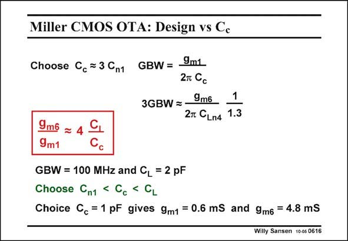

# SANSEN-0616 · Miller CMOS OTA: Design vs Cc

章节：06 运算放大器的系统化设计  
PDF 页：185；书本页：189；幻灯片编号：0616  
状态：unreviewed



## 对应教材讲解

### PDF 184 · 书本 188

As an example, let us find the currents in both stages for a given GBW and C . An appropriate compensation capacitance is selected of 1 pF, which immediately yields L the two g ’s. The currents and W/L’s are now easily calculated. m

### PDF 185 · 书本 189

A problem may be that it is not so obvious how to find the value of capacitance C . It is mainly C . As n1 GS6 long as we do not know g , m6 we do not know C either. GS6 Moreover, it would be interesting to try out a few different values of C . c

## 公式／性能结论候选摘录

以下为规则截取的原文，尚未逐项判读。

（未由规则找到；不代表原页没有此类内容。）

## 曲线结论候选摘录

以下为规则截取的原文，尚未逐项判读。

（未由规则找到；不代表原页没有此类内容。）

## 原文条件与近似候选摘录

以下为规则截取的原文，尚未逐项判读。

（未由规则找到；不代表原页没有此类内容。）

## 幻灯片 OCR（未校正）

```text
Miller CMOS OTA: Design vs Cc
Choose Cc = 3 Cn1
GBW= 9m1
27 Co
3GBW =_9m6
1
2т CLn4 1.3
9m6
9m1
GBW = 100 MHz and CL = 2 pF
Choose Cn1 < Cc < GL
Choice Cc =1 pF gives 9m1 = 0.6 mS and 9m6 = 4.8 mS
Willy Sansen 10-05 0616
```

数学上下标、分数及正负号以原图为准。电路图已保留；未核对的连接不输出成可仿真 netlist。
