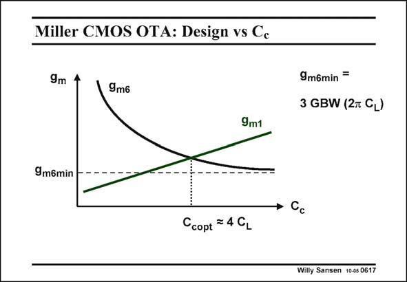

# SANSEN-0617 · Miller CMOS OTA: Design vs Cc

章节：06 运算放大器的系统化设计  
PDF 页：185；书本页：189；幻灯片编号：0617  
状态：unreviewed



## 对应教材讲解

### PDF 185 · 书本 189

These are the reasons why it is better to try a few different values of C and solve the c two equations for g and m1 g . The currents of both m6 stages can now be plotted versus capacitance C , c together with the total current consumption. This is sketched in this slide. What is obvious, is that we obtain a minimum in power consumption! The g increases with C m1 c is easy to see from the expression of the GBW. That the g now decreases with increasing C is maybe not so obvious, and yet it is clearly m6 c given by the expression of the non-dominant pole f . nd Indeed for a constant GBW and hence constant f , g decreases for increasing C . Actually nd m6 c this is not all unexpected. After all g and C ensure stability together. If one is larger, the other m6 c one can be smaller! Both curves cross at a value of C which is fairly large. Remember however that we will select c a value of C , which is 2–3 times smaller than C . This is very close to the optimum but just c L left of it! For very large values of C , g reaches a minimum. The current in the output stage reaches c m6 its minimum value. This value of g is given in this slide. It is obviously proportional to both m6 the GBW and the C . L

## 公式／性能结论候选摘录

以下为规则截取的原文，尚未逐项判读。

- PDF 185: The g increases with C m1 c is easy to see from the expression of the GBW.
- PDF 185: That the g now decreases with increasing C is maybe not so obvious, and yet it is clearly m6 c given by the expression of the non-dominant pole f . nd Indeed for a constant GBW and hence constant f , g decreases for increasing C .
- PDF 185: It is obviously proportional to both m6 the GBW and the C .

## 曲线结论候选摘录

以下为规则截取的原文，尚未逐项判读。

- PDF 185: The currents of both m6 stages can now be plotted versus capacitance C , c together with the total current consumption.
- PDF 185: Both curves cross at a value of C which is fairly large.

## 原文条件与近似候选摘录

以下为规则截取的原文，尚未逐项判读。

（未由规则找到；不代表原页没有此类内容。）

## 幻灯片 OCR（未校正）

```text
Miller CMOS OTA: Design vs Cc
9m
9m6
9m6min
3 GBW (2m CL)
9m1
9m6min
→ Cc
Ccopt = 4 CL
Willy Sansen 10-05 0617
```

数学上下标、分数及正负号以原图为准。电路图已保留；未核对的连接不输出成可仿真 netlist。
