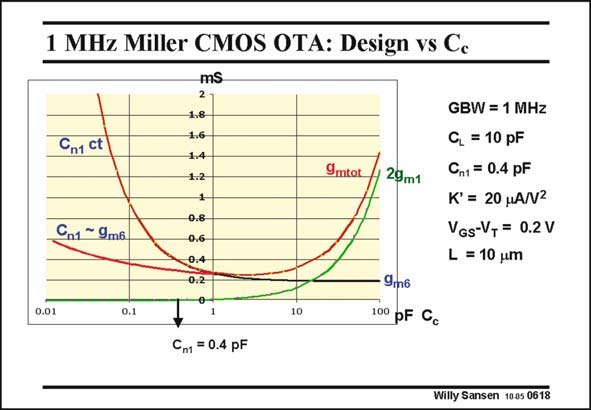

# SANSEN-0618 · 1 MHz Miller CMOS OTA: Design vs Ce

章节：06 运算放大器的系统化设计  
PDF 页：186；书本页：190；幻灯片编号：0618  
状态：unreviewed



## 对应教材讲解

### PDF 186 · 书本 190

As an example, we take the same CMOS Miller OTA of 1 MHz for 10 pF, which has been used before. The currents in both stages, i.e. 2g , g and m1 m6 g are plotted versus commtot pensation capacitance C . c Remember that they stand for 2I , I and I but DS1 DS6 tot are 10 times larger (for V −V =0.2 V). GS T It is clear that the minimum has a different shape from the previous illustration. This is an ideal plot to select a value of C . It shows that the value of 1 pF is indeed a good c choice, at least if no other specifications have to be taken into account. We could have also taken 2 or even 3 pF as well. Indeed, the additional current consumption is still less than the current through the output stage. A larger capacitance would reduce the noise, as we will see later in this Chapter. Finally, note that for these plots a constant value of C has been assumed. This is not quite n1 true, however. For larger g , the current is also larger and so is the size W/L and the input m capacitance. As a result C increases with g . If we introduce this relationship, then g is n1 m6 m6 much flatter versus C for small values of C . This does not change our choice of compensation c c capacitance however, since we have to select a value of at least 2–3 times C . n1

## 公式／性能结论候选摘录

以下为规则截取的原文，尚未逐项判读。

- PDF 186: As a result C increases with g .

## 曲线结论候选摘录

以下为规则截取的原文，尚未逐项判读。

- PDF 186: The currents in both stages, i.e. 2g , g and m1 m6 g are plotted versus commtot pensation capacitance C . c Remember that they stand for 2I , I and I but DS1 DS6 tot are 10 times larger (for V −V =0.2 V).
- PDF 186: This is an ideal plot to select a value of C .
- PDF 186: Finally, note that for these plots a constant value of C has been assumed.

## 原文条件与近似候选摘录

以下为规则截取的原文，尚未逐项判读。

- PDF 186: Finally, note that for these plots a constant value of C has been assumed.

## 幻灯片 OCR（未校正）

```text
1 MHz Miller CMOS OTA: Design vs Ce
Cn1 ct
Cn1 ~ 9m6.
mS
2
1.8
1.6
1.4
1.2
1
0.8
0,6
0.4
0.2
9mtot
29m1
GBW = 1 MHz
C, = 10 pF
Cn1 = 0.4 pF
K' = 20 MA/V2
VGs-V, = 0.2 V
L = 10 um
0.01
0.1
10
9mб
100 pF Cc
Cn1 = 0.4 pF
Willy Sansen 1005 0618
```

数学上下标、分数及正负号以原图为准。电路图已保留；未核对的连接不输出成可仿真 netlist。
