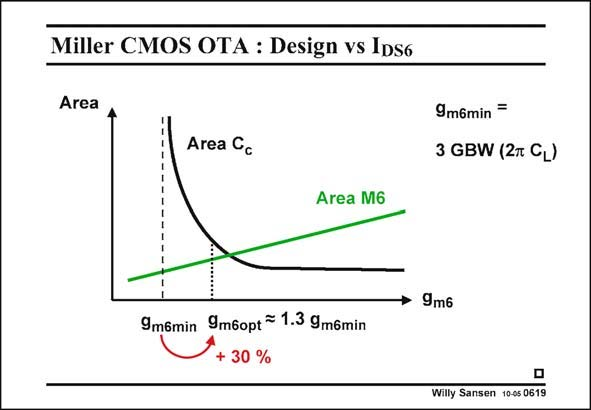

# SANSEN-0619 · Miller CMOS OTA : Design vs IDS6

章节：06 运算放大器的系统化设计  
PDF 页：186；书本页：190；幻灯片编号：0619  
状态：unreviewed



## 对应教材讲解

### PDF 186 · 书本 190

The second design plan is to choose g or the current in m6 the output stage. This is also very easy. Indeed, we already know what the minimum value of g is. It is repeated in this m6 slide. It is the value of g m6 obtained for infinite C . c We now simply take a g m6 value which is 30% larger. This means that C will end c up at a value which is about 3 times C , as explained by n1 the expression of the nondominant pole. This value of g should be close to the minimum in area, which is illustrated in this slide. m6

### PDF 187 · 书本 191

The advantage of taking g as an independent variable, is that we can now easily calculate m6 C , which is little more than C . n1 GS6 Moreover, it is more evident to start with g in this design plan. After all, the current in the m6 output stage is by far the larger one. We therefore want to focus on the minimization of this current first.

## 公式／性能结论候选摘录

以下为规则截取的原文，尚未逐项判读。

- PDF 187: The advantage of taking g as an independent variable, is that we can now easily calculate m6 C , which is little more than C . n1 GS6 Moreover, it is more evident to start with g in this design plan.
- PDF 187: We therefore want to focus on the minimization of this current first.

## 曲线结论候选摘录

以下为规则截取的原文，尚未逐项判读。

（未由规则找到；不代表原页没有此类内容。）

## 原文条件与近似候选摘录

以下为规则截取的原文，尚未逐项判读。

（未由规则找到；不代表原页没有此类内容。）

## 幻灯片 OCR（未校正）

```text
Miller CMOS OTA : Design vs IDS6
Area
Area Cc
9m6min
3 GBW (2m CL)
Area M6
9m6min
9m6opt = 1.3 9m6min
+ 30 %
• 9m6
Willy Sansen 10-05 0619
```

数学上下标、分数及正负号以原图为准。电路图已保留；未核对的连接不输出成可仿真 netlist。
