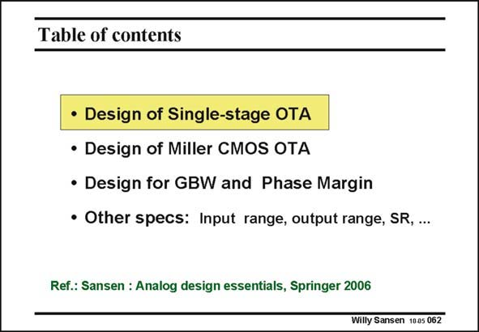

# SANSEN-062 · Table of contents

章节：06 运算放大器的系统化设计  
PDF 页：177；书本页：181；幻灯片编号：062  
状态：unreviewed



## 对应教材讲解

### PDF 177 · 书本 181

The transistor implementation of a single-transistor amplifier is given first. It is followed by a twotransistor Miller OTA. A detailed design plan is discussed, to give rise to the lowest possible power consumption. Moreover, the maximum GBW is estimated for a specific CMOS technology. It is shown that GHz values are easily reached. Finally, all other specifications are listed, a few of which are discussed for the two-stage Miller OTA. The same CMOS Miller OTA is used throughout. All numerical values relate to the same amplifier. As a result, the reader can give himself a good idea about the appropriate orders of magnitudes. The design of a single-stage OTA is approached first.

## 公式／性能结论候选摘录

以下为规则截取的原文，尚未逐项判读。

- PDF 177: As a result, the reader can give himself a good idea about the appropriate orders of magnitudes.

## 曲线结论候选摘录

以下为规则截取的原文，尚未逐项判读。

（未由规则找到；不代表原页没有此类内容。）

## 原文条件与近似候选摘录

以下为规则截取的原文，尚未逐项判读。

（未由规则找到；不代表原页没有此类内容。）

## 幻灯片 OCR（未校正）

```text
Table of contents
• Design of Single-stage OTA
• Design of Miller CMOS OTA
• Design for GBW and Phase Margin
• Other specs: Input range, output range, SR, ...
Ref.: Sansen : Analog design essentials, Springer 2006
Willy Sansen 10.05 062
```

数学上下标、分数及正负号以原图为准。电路图已保留；未核对的连接不输出成可仿真 netlist。
