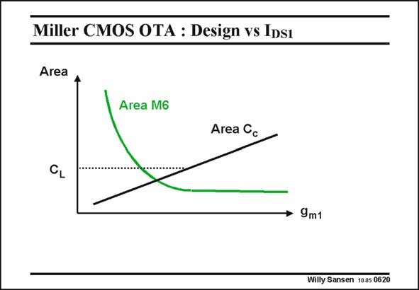

# SANSEN-0620 · Miller CMOS OTA : Design vs Ips1

章节：06 运算放大器的系统化设计  
PDF 页：187；书本页：191；幻灯片编号：0620  
状态：unreviewed



## 对应教材讲解

### PDF 187 · 书本 191

Finally, the third design plan is to start with a selection of the current in the input stage. A possible reason to go for this design plan, could be the noise performance. After all the equivalent input noise voltage will depend on the transconductances of the MOSTs in the input stage. Again, a minimum is reached when we plot the total area versus g . m1 Once C becomes C c L divided by 2–3, then we obtain a value of g which is similar to the values obtained by the m1 previous design plans. However, it is not worked out any further.

## 公式／性能结论候选摘录

以下为规则截取的原文，尚未逐项判读。

- PDF 187: After all the equivalent input noise voltage will depend on the transconductances of the MOSTs in the input stage.

## 曲线结论候选摘录

以下为规则截取的原文，尚未逐项判读。

- PDF 187: Again, a minimum is reached when we plot the total area versus g . m1 Once C becomes C c L divided by 2–3, then we obtain a value of g which is similar to the values obtained by the m1 previous design plans.

## 原文条件与近似候选摘录

以下为规则截取的原文，尚未逐项判读。

（未由规则找到；不代表原页没有此类内容。）

## 幻灯片 OCR（未校正）

```text
Miller CMOS OTA : Design vs Ips1
Area
Area M6
Area Cc
CL
• 9m1
Willy Sansen 1005 0620
```

数学上下标、分数及正负号以原图为准。电路图已保留；未核对的连接不输出成可仿真 netlist。
