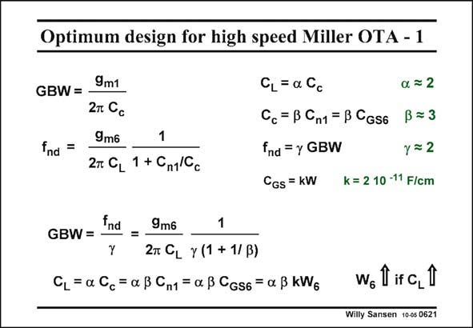

# SANSEN-0621 · Optimum design for high speed Miller OTA - 1

章节：06 运算放大器的系统化设计  
PDF 页：187；书本页：191；幻灯片编号：0621  
状态：unreviewed



## 对应教材讲解

### PDF 187 · 书本 191

This design procedure can now easily be formalized, for such a Miller CMOS OTA. The goal is to find out what maximum GBW can be reached within a certain CMOS technology. Also, we want to find the shortest way to design this OTA. First of all, a number of design choices have to be made. They have all been previously used. We list them again and introduce design parameters a, b and c. Parameter a sets the ratio between C and C . Take 2 as an example. L c Parameter b sets the ratio between C and C or C . Take 3 as an example. Also, remember c n1 GS6

### PDF 188 · 书本 192

that C can easily be described as a function of the transistor width; the k parameter is GS about 2 fF/mm. Parameter c sets the ratio between f and C . We have taken 3 many times, let us take 2 for nd c this example. The maximum GBW can now easily be described as a fraction c of the non-dominant pole. Also, note that C can be described in terms of the width of the output transistor. Obviously, L the larger the C , the more current we will need to drive it, and the larger the transistor width L becomes!

## 公式／性能结论候选摘录

以下为规则截取的原文，尚未逐项判读。

（未由规则找到；不代表原页没有此类内容。）

## 曲线结论候选摘录

以下为规则截取的原文，尚未逐项判读。

（未由规则找到；不代表原页没有此类内容。）

## 原文条件与近似候选摘录

以下为规则截取的原文，尚未逐项判读。

（未由规则找到；不代表原页没有此类内容。）

## 幻灯片 OCR（未校正）

```text
Optimum design for high speed Miller OTA - 1
9m1
GBW= -
2T Cс
9m6
1
fnd =
2т. CL 1 + Cn1/C.
CL=aGc
Cc= B Cn1 = B CGs6
fnd = y GBW
a = 2
ß = 3
y=2
CGs = kW
k = 2 10 -11 F/cm
GBW =
Ind =
9m6
1
Y
2T CL Y (1 + 1/ B)
CL= a Cc=a BCn1 = a B CGs6 = a B KWg
wolifa,l
Willy Sansen 10-05 0621
```

数学上下标、分数及正负号以原图为准。电路图已保留；未核对的连接不输出成可仿真 netlist。
