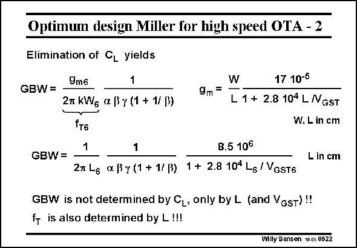

# SANSEN-0622 · Optimum design Miller for high speed OTA - 2

章节：06 运算放大器的系统化设计  
PDF 页：188；书本页：192；幻灯片编号：0622  
状态：unreviewed



## 对应教材讲解

### PDF 188 · 书本 192

The last expression of C L can now be substituted in the expression of the GBW. We now take the general expression of g from the m first Chapter on models. Remember that this is the expression which spans both the strong inversion and velocity saturation regions. These are the regions which we will use for high speed. Substitution of this g m expression in the one of the GBW, yields an expression in which only V −V and GS T L are left as parameters. This is not surprising at all. We have known all along that these are the two choices that we have to make for any transistor in the signal path. It is surprising, however, to find that the maximum GBW does not depend on the load capacitance. Actually, increasing the load capacitance increases the width of the output transistor and its current. The speed of the output transistor mainly depends on its length! The speed of a MOST is better represented by parameter f . This is why we now try to T substitute the transistor parameters V −V and L by parameter f . GS T T

## 公式／性能结论候选摘录

以下为规则截取的原文，尚未逐项判读。

- PDF 188: It is surprising, however, to find that the maximum GBW does not depend on the load capacitance.
- PDF 188: Actually, increasing the load capacitance increases the width of the output transistor and its current.
- PDF 188: The speed of the output transistor mainly depends on its length!

## 曲线结论候选摘录

以下为规则截取的原文，尚未逐项判读。

（未由规则找到；不代表原页没有此类内容。）

## 原文条件与近似候选摘录

以下为规则截取的原文，尚未逐项判读。

- PDF 188: Remember that this is the expression which spans both the strong inversion and velocity saturation regions.

## 幻灯片 OCR（未校正）

```text
Optimum design Miller for high speed OTA - 2
Elimination of CL yields
9m6
1
GBW=
2m kWg ae By (1 + 1/ß)
fт6
1
W
17 10-5
9m=
L 1 + 2.8 104 L NGST
W. L in cm
GBW=
1
2n L6 xßy (1 + 1/B)
8.5 106
1 + 2.8 104 L6 / VGsT6
L in cm
GBW is not determined by CL, only by L (and Vost)!!
f is also determined by L !!!
Willy Sansen 1005 0622
```

数学上下标、分数及正负号以原图为准。电路图已保留；未核对的连接不输出成可仿真 netlist。
