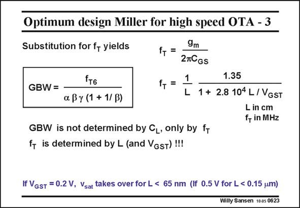

# SANSEN-0623 · Optimum design Miller for high speed OTA - 3

章节：06 运算放大器的系统化设计  
PDF 页：189；书本页：193；幻灯片编号：0623  
状态：unreviewed



## 对应教材讲解

### PDF 188 · 书本 192

The expression of parameter f for both the weak inversion and velocity saturation regions are T taken from Chapter 1. Clearly, it depends on V −V and L, very much as the GBW does. GS T Substitution now yields a final expression of the GBW with only f as a parameter. T For the values previously chosen, we find that the maximum GBW is about 1/16 of the f of T the output device. A two-stage Miller CMOS OTA can have a GBW of 5 GHz, provided we select a CMOS technology where an f of 80 GHz can be obtained. Checking the f curves of Chapter 1, we find T T

### PDF 189 · 书本 193

that a 80 nm CMOS is required for that (for V −V =0.2 V), but only GS T 0.1 mm technology if we make V =0.5 V. GST The actual power consumption will depend on the capacitive load. The larger the load, the higher the power consumption! The optimum design plan has now become fairly simple, as shown next.

## 公式／性能结论候选摘录

以下为规则截取的原文，尚未逐项判读。

- PDF 188: Clearly, it depends on V −V and L, very much as the GBW does.
- PDF 189: GST The actual power consumption will depend on the capacitive load.

## 曲线结论候选摘录

以下为规则截取的原文，尚未逐项判读。

- PDF 188: Checking the f curves of Chapter 1, we find T T

## 原文条件与近似候选摘录

以下为规则截取的原文，尚未逐项判读。

- PDF 188: The expression of parameter f for both the weak inversion and velocity saturation regions are T taken from Chapter 1.
- PDF 188: A two-stage Miller CMOS OTA can have a GBW of 5 GHz, provided we select a CMOS technology where an f of 80 GHz can be obtained.

## 幻灯片 OCR（未校正）

```text
Optimum design Miller for high speed OTA - 3
Substitution for f+ yields
fт6
GBW =
a By (1 + 1/ B)
9m
f+ =
27CGs
f, =
1
L
1.35
1 + 2.8 104 L / VGST
L in cm
f, in MHz
GBW is not determined by CL, only by fr
fT is determined by L (and VGsT)!!!
If VgsT = 0.2 V, Vsat takes over for L < 65 nm (lf 0.5 V for L < 0.15 um)
Willy Sansen 1005 0623
```

数学上下标、分数及正负号以原图为准。电路图已保留；未核对的连接不输出成可仿真 netlist。
