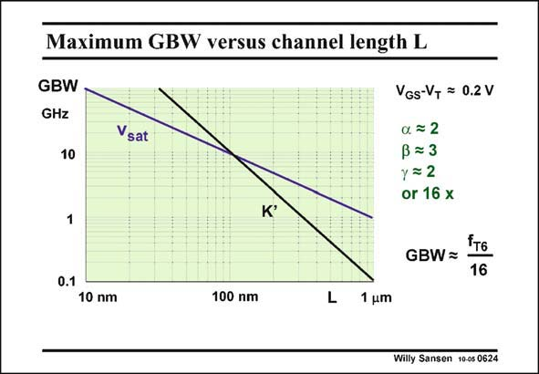

# SANSEN-0624 · Maximum GBW versus channel length L

章节：06 运算放大器的系统化设计  
PDF 页：189；书本页：193；幻灯片编号：0624  
状态：unreviewed



## 对应教材讲解

### PDF 189 · 书本 193

However, before the design plan is spelled out, let us see what values of GBW are available for different values of channel length. For this purpose, the values of f have to be T obtained from Chapter 1. They refer to transistor M6. A value is taken of V −V =0.2 V. GS T The parameters a, b and c have to be selected. They are taken the same as before, giving rise to a ratio of 16 between f and the maxi- T6 mum GBW. The plot shows that for large channel lengths, where the mobility (K∞) model is still valid, a GBW is obtained if the channel length L is not larger than 0.35 mm. For smaller channel lengths, the velocity saturation model evidently prevails. A 10 GHz GBW can be realized provided the minimum channel length is now 90 nm or less. This is also the cross-over value of the channel length from one model to the other!

## 公式／性能结论候选摘录

以下为规则截取的原文，尚未逐项判读。

（未由规则找到；不代表原页没有此类内容。）

## 曲线结论候选摘录

以下为规则截取的原文，尚未逐项判读。

- PDF 189: The plot shows that for large channel lengths, where the mobility (K∞) model is still valid, a GBW is obtained if the channel length L is not larger than 0.35 mm.

## 原文条件与近似候选摘录

以下为规则截取的原文，尚未逐项判读。

- PDF 189: For smaller channel lengths, the velocity saturation model evidently prevails.
- PDF 189: A 10 GHz GBW can be realized provided the minimum channel length is now 90 nm or less.

## 幻灯片 OCR（未校正）

```text
Maximum GBW versus channel length L
GBW
GHz
10
Vsat
VGs-V+ = 0.2 V
a. = 2
ß = 3
y = 2
or 16 x
K'
1
GBW =
"т6
16
0.1
10 nm
100 mm
L
1 um
Willy Sansen 10-05 0624
```

数学上下标、分数及正负号以原图为准。电路图已保留；未核对的连接不输出成可仿真 netlist。
