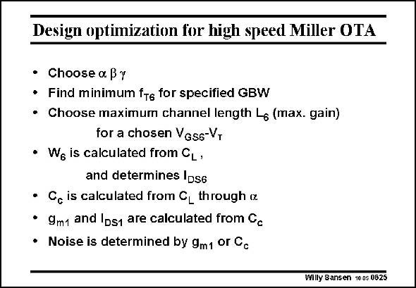

# SANSEN-0625 · Design optimization for high speed Miller OTA

章节：06 运算放大器的系统化设计  
PDF 页：190；书本页：194；幻灯片编号：0625  
状态：unreviewed



## 对应教材讲解

### PDF 189 · 书本 193

Let us now draw up a design plan. The three design choices have to be selected first.

### PDF 190 · 书本 194

We must find the minimum f which can handle T the process. The higher f , T the smaller the channel length will be and the more expensive the CMOS technology required. A minimum f leads to a minimum T channel length L. We now choose the actual channel length. It can be the minimum channel length or a somewhat larger value, depending on the gain required. Also, the value of V −V must be selected. GS T The capacitive load now determines the output transistor width, and its current. All other values are now easily derived.

## 公式／性能结论候选摘录

以下为规则截取的原文，尚未逐项判读。

- PDF 190: It can be the minimum channel length or a somewhat larger value, depending on the gain required.

## 曲线结论候选摘录

以下为规则截取的原文，尚未逐项判读。

（未由规则找到；不代表原页没有此类内容。）

## 原文条件与近似候选摘录

以下为规则截取的原文，尚未逐项判读。

（未由规则找到；不代表原页没有此类内容。）

## 幻灯片 OCR（未校正）

```text
Design optimization for high speed Miller OTA
• Choose a By
• Find minimum ftg for specified GBW
Choose maximum channel length L6 (max. gain)
for a chosen VGss-V,
• We is calculated from CL,
and determines IDse
• C. is calculated from CL through ix
• 9m1 and Ips1 are calculated from Cc
• Noise is determined by 9m1 or Cc
Willy Sansen 1005 0625
```

数学上下标、分数及正负号以原图为准。电路图已保留；未核对的连接不输出成可仿真 netlist。
